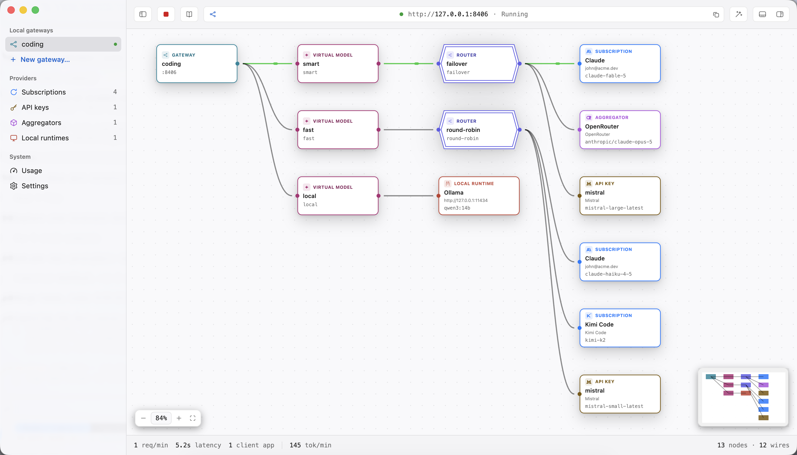

<p align="center">
  <a href="https://recompose.sh"></a>
</p>
<h1 align="center">recompose</h1>

<p align="center">
  Every model, in every harness, one gateway to run.
</p>

<div align="center">
  <a href="https://recompose.sh">Website</a>
  <span>&nbsp;&nbsp;•&nbsp;&nbsp;</span>
  <a href="https://recompose.sh/download">Download</a>
  <span>&nbsp;&nbsp;•&nbsp;&nbsp;</span>
  <a href="https://recompose.sh/docs">Docs</a>
  <span>&nbsp;&nbsp;•&nbsp;&nbsp;</span>
  <a href="https://recompose.sh/changelog">Changelog</a>
</div>

<br>

<div align="center">

[![CI][ci-badge]][ci-url]
[![CodeQL][codeql-badge]][codeql-url]
[![latest release][release-badge]][release-url]
[![license][license-badge]][license-url]
[![platforms][platform-badge]][download-url]

[![Electron][electron-badge]][electron-url]
[![TypeScript][typescript-badge]][typescript-url]
[![React][react-badge]][react-url]
[![Tailwind CSS][tailwind-badge]][tailwind-url]
[![TanStack][tanstack-badge]][tanstack-url]
[![Vitest][vitest-badge]][vitest-url]
[![Playwright][playwright-badge]][playwright-url]
[![pnpm][pnpm-badge]][pnpm-url]
[![Turborepo][turbo-badge]][turbo-url]

</div>

<p align="center">
  <picture>
    <source media="(prefers-color-scheme: dark)" srcset="docs/assets/canvas-dark.png">
    <source media="(prefers-color-scheme: light)" srcset="docs/assets/canvas-light.png">
    
  </picture>
</p>

<p align="center">
  <i>The gateway canvas: virtual models wired through routers to provider targets.</i>
</p>

recompose is a free, open-source desktop app that composes your AI subscriptions, API keys, aggregators, and local runtimes into gateways served from your own machine. You define virtual models, wire them to real providers on a node canvas, and point clients such as Claude Code, Codex, and Cursor at one local address.

## Download

```sh
brew install --cask recomposesh/tap/recompose
```

| macOS                           | Windows                 | Linux                         |
| ------------------------------- | ----------------------- | ----------------------------- |
| [Homebrew][brew] (recommended)  | [Installer (.exe)][win] | [AppImage][appimage]          |
| [Apple Silicon (.dmg)][mac-arm] |                         | [Debian / Ubuntu (.deb)][deb] |
| [Intel (.dmg)][mac-intel]       |                         |                               |

The app updates itself through whichever channel installed it: a dmg install pulls updates on its own, the AppImage replaces itself, and Homebrew waits for the cask. macOS builds carry a Developer ID signature and Apple's notary ticket, and need macOS 12 Monterey or later.

> [!NOTE]
> The Windows installer carries no signature yet, so SmartScreen shows a warning on first launch. Pick "More info," then "Run anyway."

## How it works

A gateway is a running local server that owns one port. Its canvas wires virtual models through routers to provider targets:

```
Claude Code ──▶ http://localhost:8397
                       │
              [ gateway "coding" ]
                       │
             [ virtual model "fast" ]
                       │
              [ router · failover ]
                #1 │         #2 │
     [ Claude · sonnet ]  [ OpenAI · gpt-5 ]
```

Clients connect through an environment variable:

```sh
export ANTHROPIC_BASE_URL=http://localhost:8397
```

OpenAI-dialect clients set `OPENAI_BASE_URL` to the same address.

## Features

- **One address for every client**: each gateway serves both API dialects on its own port, `/v1/messages` (Anthropic) and `/v1/chat/completions` (OpenAI). The request path picks the dialect, and there is nothing to configure per client.
- **Virtual models**: clients see aliases such as `fast` or `smart`. Swap the real model behind that name without touching a single client config.
- **Composable routing**: failover ladders send traffic to the topmost healthy target, round-robin pools spread it evenly, and routers chain to combine strategies.
- **Every provider shape**: subscriptions the provider's own tool signs in (Claude, Codex, and more), API keys the gateway spends request by request, aggregators such as OpenRouter, and local runtimes such as Ollama.
- **Private by default**: no signup, no telemetry. Credentials stay on your machine in `~/.recompose`, with secrets in the system vault. Serving on a Local Area Network (LAN) is opt-in, and the app recommends turning on the local API token when you do.

## Documentation

The handbook lives at [recompose.sh/docs](https://recompose.sh/docs): installation, connecting providers, composing gateways, and operating them day to day.

## Building from source

Requires Node 22.18 or later and pnpm 11.

```sh
pnpm install
pnpm dev
```

`pnpm dev` opens the Electron app with hot reload. `pnpm build` compiles every workspace, and `pnpm test` runs the unit suites.

## Architecture

- **`apps/desktop`**: the Electron app. The main process owns the gateway engine in a utility process, and the renderer is a React app organized by Feature-Sliced Design.
- **`apps/web`**: the public site, statically built: landing, docs, download, and changelog.
- **`docs/adr`**: every technical decision, recorded as an Architecture Decision Record (ADR).

[ci-badge]: https://github.com/recomposesh/recompose/actions/workflows/ci.yml/badge.svg
[ci-url]: https://github.com/recomposesh/recompose/actions/workflows/ci.yml
[codeql-badge]: https://github.com/recomposesh/recompose/actions/workflows/codeql.yml/badge.svg
[codeql-url]: https://github.com/recomposesh/recompose/actions/workflows/codeql.yml
[release-badge]: https://img.shields.io/github/v/release/recomposesh/recompose?label=release&color=369eff
[release-url]: https://recompose.sh/changelog
[license-badge]: https://img.shields.io/github/license/recomposesh/recompose?color=8ae8ff
[license-url]: LICENSE
[platform-badge]: https://img.shields.io/badge/platform-macOS%20%7C%20Windows%20%7C%20Linux-444
[download-url]: https://recompose.sh/download
[electron-badge]: https://img.shields.io/badge/Electron_43-2f3241?logo=electron&logoColor=9feaf9
[electron-url]: https://www.electronjs.org
[typescript-badge]: https://img.shields.io/badge/TypeScript-3178c6?logo=typescript&logoColor=white
[typescript-url]: https://www.typescriptlang.org
[react-badge]: https://img.shields.io/badge/React_19-087ea4?logo=react&logoColor=white
[react-url]: https://react.dev
[tailwind-badge]: https://img.shields.io/badge/Tailwind_CSS_4-0f172a?logo=tailwindcss&logoColor=38bdf8
[tailwind-url]: https://tailwindcss.com
[tanstack-badge]: https://img.shields.io/badge/TanStack-fd4f00
[tanstack-url]: https://tanstack.com
[vitest-badge]: https://img.shields.io/badge/Vitest_4-6e9f18?logo=vitest&logoColor=white
[vitest-url]: https://vitest.dev
[playwright-badge]: https://img.shields.io/badge/Playwright-2ead33?logo=playwright&logoColor=white
[playwright-url]: https://playwright.dev
[pnpm-badge]: https://img.shields.io/badge/pnpm-f69220?logo=pnpm&logoColor=white
[pnpm-url]: https://pnpm.io
[turbo-badge]: https://img.shields.io/badge/Turborepo-000?logo=turborepo&logoColor=ef4444
[turbo-url]: https://turborepo.com
[brew]: https://github.com/recomposesh/homebrew-tap
[mac-arm]: https://recompose.sh/download/mac-arm64
[mac-intel]: https://recompose.sh/download/mac-x64
[win]: https://recompose.sh/download/windows
[appimage]: https://recompose.sh/download/linux-appimage
[deb]: https://recompose.sh/download/linux-deb
