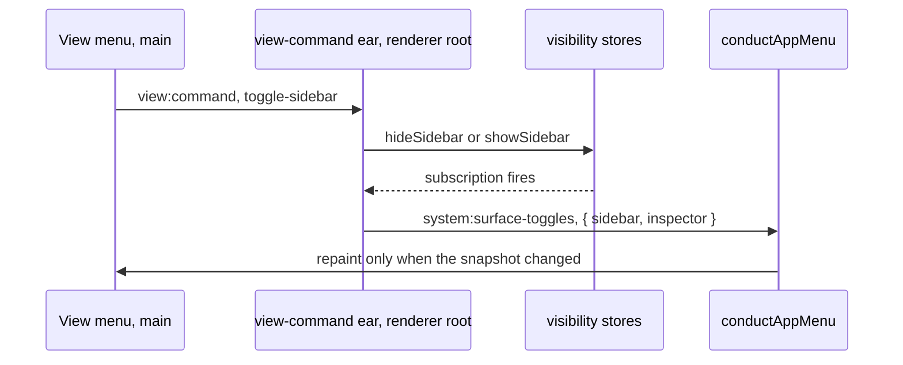

# Solution design

## Header and change linkage

- Change id: app-menu-shortcuts
- Schema: recompose
- Proposal: [proposal.md](proposal.md)
- Specs: [specs/app-menu/spec.md](specs/app-menu/spec.md), [specs/usage/spec.md](specs/usage/spec.md)
- Discovery: [discovery/](discovery/)
- Tasks: tasks.md, which the next gate derives from this document

## Context

The desktop application builds its whole menu bar in the main process. One template function,
`buildAppMenuTemplate`, produces every menu from a small view value, and a conductor reinstalls
the menu whenever that value changes. Today the template ends at the window menu with no Help
menu, and the onboarding checklist sits in the macOS app menu. The route-scoped Gateway and
Usage menus splice in and out as a window navigates. The Usage menu spends the plain number
accelerators on time ranges, and the canvas claims the reset chord for fitting. A packaged build
swallows the reload and devtools keystrokes the View menu prints. No Dock menu exists.

The proposal locks fourteen decisions that fix the target shape. This document supplies the
mechanism: which value lands in which file, what each side of the wire carries, and what proves
each behavior. It also fixes how the work splits into tasks that run in parallel without
touching one another's files.

## Discovery inputs consumed

- Code map, `optimizer.watchWindowShortcuts(window, { zoom: true })` at
  `apps/desktop/src/main/index.ts:254`: named the one call the packaged-guard decision scopes to
  development.
- Code map, `USAGE_SEARCH_RANGES` private to
  `apps/desktop/src/renderer/src/pages/usage/lib/usage-search.ts`: forced the vocabulary's move
  into `packages/contracts`, because the menu builder can't import a page slice.
- Code map, no `app.dock` call site under `apps/desktop/src/main`: made the Dock menu greenfield
  work beside the tray.
- Code map, `actsOn` returning `Record<CanvasCommand, () => void>` in
  `apps/desktop/src/renderer/src/pages/gateway-canvas/lib/use-canvas-commands.ts`: made the
  compiler the enforcement for every `canvas:command` widening.
- Code map, `useMenuReadsTheDrawer` in the canvas page hooks: the report pattern the
  surface-toggle snapshot copies.
- Code map, `noteLogsDrawer: appMenu.reflectLogsDrawer` at
  `apps/desktop/src/main/ipc/register-ipc.ts:115`: the wiring shape the new report channel
  repeats.
- Code map, no gateway rename affordance on the canvas: consulted, no impact, because locked
  decision 1 already cut the item.
- Code map, no `engine:restart` channel beside a main-side `restart` on the lifecycle requests:
  shaped the zero-wire lifecycle answer in decision 2.
- Research, the installed `@electron-toolkit/utils` guard eats `KeyR` and the devtools chord in
  a packaged run: widened the dead-keystroke repair to two rows and settled removal over
  patching.
- Research, `registerAccelerator` binds on Linux and Windows only: killed every
  print-without-registering exit, which leaves the guard removal as the honest repair.
- Research, Electron issues 4479 and 23683: Help stands last inside one rebuilt template, prints
  no accelerator on its role, and keeps the search-field walk as a manual check.
- Research, Electron issue 7737 beside the platform dimming rule: the menu item type grows
  `enabled`, and no item ever hides.
- Research, the `Alt` spelling rule and Electron issue 45925: every range chord reads
  `Alt+CmdOrCtrl`, with one manual press test on the target build.
- Research, Electron's `resetZoom` role resets web-contents zoom rather than the canvas: the
  100% item stays a custom click carrying `zoom-to-100`.
- Research, `dock.setMenu` works only after ready and refreshes nothing itself: the Dock
  repainter rebuilds and re-sets a fresh menu on every state change.
- Acceptance references, the stays-back run owns no Dock tile: the install decision keys off the
  same `activationPolicyFor` answer that removed the tile.
- Acceptance references, Electron issue 12636's open-menu rebuild history: every reflect method
  gains the equality short-circuit, and a hold-open manual check guards the regression.
- Acceptance references, the harness drives no native menu: accelerator and enablement proof
  lands in unit specs, and the two new harness readers land with the change.
- Mobbin, fitting and a numeric level never share one control: backs the zoom split.
- Mobbin, `Cmd+/` as the shortcut-reference binding: consulted, no impact, because the overlay
  stays deferred and the Help menu ships three items.
- Rider ledger, empty, with closed issue 108 adjacent: the gateways pick reuses the home landing
  rule that issue shaped.

## Goals and non-goals

**Goals:**

- A platform-shaped menu bar: the standard order, a trailing Help menu on every platform and
  route, and the checklist under View.
- View walks the app on the plain digits and toggles the sidebar and inspector from truth the
  renderer reports.
- The Usage menu names every ledger range on Option-modified digits, read from one shared
  vocabulary.
- The Gateway menu drives the standing gateway's lifecycle and splits resetting to 100% from
  fitting.
- Every keystroke the menu prints fires in a packaged build.
- A macOS Dock menu mirroring the tray's per-gateway lifecycle submenus.
- The end-to-end harness reads enablement and printed accelerators.

**Non-goals:**

- A command palette, a Find surface, or an in-app shortcut overlay. Each needs a new surface,
  and rider issue 245 holds them.
- A gateway Rename item. The canvas offers no rename affordance, and rider issue 244 holds it,
  per locked decision 1.
- A Keyboard Shortcuts item in Help. Locked decision 2 ships three items.
- An `engine:restart` channel, or any change to the renderer's lifecycle mutations.
- Icons on the Dock submenus. Locked decision 10 starts without them.
- Engine changes, stored-document changes, design-token changes, or new Storybook stories.

## Constraints and invariants

- TypeScript at maximum strictness: `strict: true` plus `noUncheckedIndexedAccess`,
  `exactOptionalPropertyTypes`, `noImplicitOverride`, `noFallthroughCasesInSwitch`, and
  `noPropertyAccessFromIndexSignature`. No `any`, and no `as` casts to silence errors.
- Never write code comments. The sole exception is a constraint the code can't express, and a
  `@summary` docstring records constraints and rejected alternatives, never narration.
- Never disable, override, loosen, or silence any gate. Gates run once at the end of authoring,
  and findings get fixed in one batch.
- Test code changes if and only if behavior changes. The template split below is a pure refactor
  behind `buildAppMenuTemplate`, so it touches no existing template spec on its own.
- Renderer files follow Feature-Sliced Design (FSD) v2.1. Command answers stay in the page slice
  that owns each surface, and the reported visibility state stays in `shared/lib/visibility`,
  where it already lives. Main, preload, and contracts sit outside FSD.
- No new component lands under a `ui/` segment, so no story obligation follows.
- Node-side logic must survive the diff-scoped mutation gate.
- Never use an em dash, and every technical decision lands as an
  Architecture Decision Record (ADR).

## Design

### The shape

Three moves carry the whole change.

1. **Contracts widen first.** The range vocabulary, the reveal-label table, two widened command
   enums, one push event, and one report channel land in `packages/contracts`. Every consumer
   compiles against them, so the exhaustive command maps in the renderer and the totality specs
   in the package turn each widening into a red build until every side answers.
2. **What never crosses the wire stays in main.** Navigation, gateway lifecycle, the Help
   handlers, the Dock menu, and the guard removal all terminate in seams main already holds:
   `openSurface` behind the settings shortcut, `createGatewayLifecycleRequests` behind the tray,
   `shell.openExternal` and `shell.openPath`, and the tray's submenu shape. No new wire word
   exists for any of them, and the totality spec pins the absences.
3. **The renderer answers and reports.** The root shell answers `view:command` through the
   standing visibility stores and reports one snapshot back over `system:surface-toggles`. The
   canvas page answers the widened `canvas:command`, and the usage page answers the widened
   `usage:command`. Each tick in the menu reads the report, never the menu's own last push.

### The menu template splits by menu

`app-menu-template.ts` stands at 243 lines against a 300-line gate, and this change grows every
menu. The template file keeps `AppMenuItem`, `AppMenuHandlers`, `AppMenuView`,
`buildAppMenuTemplate`, and the leading menus. The Help, View, Gateway, and Usage builders move
into sibling modules under `apps/desktop/src/main/menu/`. The split answers the max-lines gate
by single responsibility before the gate blocks. The existing specs keep exercising the one
public seam, `buildAppMenuTemplate`, so the move alone touches no test.

The menu bar's order stays the locked one: the app menu on macOS, File, Edit, View, the
route-scoped Gateway and Usage menus, and Window. Help trails on every platform and route.
The checklist toggle leaves `macApplicationMenu` and heads View on every platform.

### The accelerator map

| Item                  | Chord                                  | Menu    |
| --------------------- | -------------------------------------- | ------- |
| Gateways              | `CmdOrCtrl+1`                          | View    |
| Providers             | `CmdOrCtrl+2`                          | View    |
| Usage                 | `CmdOrCtrl+3`                          | View    |
| Show Sidebar          | `CmdOrCtrl+B`                          | View    |
| Show Inspector        | `Alt+CmdOrCtrl+B`                      | View    |
| Start                 | `CmdOrCtrl+Return`                     | Gateway |
| Stop                  | `CmdOrCtrl+.`                          | Gateway |
| Restart               | `Shift+CmdOrCtrl+Return`               | Gateway |
| Zoom In               | `CmdOrCtrl+=`                          | Gateway |
| Zoom Out              | `CmdOrCtrl+-`                          | Gateway |
| Actual Size           | `CmdOrCtrl+0`                          | Gateway |
| Zoom to Fit           | `Shift+CmdOrCtrl+0`                    | Gateway |
| Tidy                  | `Alt+CmdOrCtrl+T`                      | Gateway |
| Show Logs             | `CmdOrCtrl+Shift+L`                    | Gateway |
| Ranges, address order | `Alt+CmdOrCtrl+1` to `Alt+CmdOrCtrl+6` | Usage   |
| Custom Range…         | none                                   | Usage   |
| Show Data Table       | `CmdOrCtrl+Shift+T`                    | Usage   |
| Refresh Usage         | `Alt+CmdOrCtrl+R`                      | Usage   |

Every chord spells `Alt`, never `Option`, and no item anywhere sets `visible: false`, because a
hidden item's accelerator can still fire on macOS while an unavailable one can't. The Gateway menu's
order runs lifecycle group, Copy Base URL, zoom group, Tidy, Show Logs, and Delete Gateway last.
Copy Base URL and Delete Gateway carry no chord.

### The conductor's repaint discipline

`AppMenuView` grows `sidebarShown`, `inspectorOpen`, `standingGatewaySlug`, and
`gatewayServing`. `AppMenuConduct` grows `reflectSurfaceToggles` and `reflectEngineStates`
beside the standing reflectors, and every reflect method takes the equality short-circuit
`standOnUrl` already has: a report carrying the standing value repaints nothing.
`reflectEngineStates` compares the derived serving flag for the standing slug, never object
identity, so a state push that changes nothing the template reads installs no menu.

`standOnUrl` also extracts the standing slug through a new `gatewayDetailSlugFrom` in
`renderer-url.ts`. A new `standNowhere` method clears the route-scoped view, and the
window-created block in `index.ts` calls it from a `closed` hook once the last window goes.
Route-scoped menus leave with the window, so no Gateway item survives to push a command into the
void.

### The toggle round trip



The order carries the design: the tick reads the renderer's report, never the push main sent.
The on-screen toggles drive the same stores, so a toolbar click travels the same report path and
the menu tick follows without the menu ever opening. The inspector item stays visible off the
canvas and renders as unavailable through `enabled: view.onGatewayDetail`.

### Navigation with no window

The three navigation handlers bind to `openGatewaysSurface`, `openProvidersSurface`, and
`openUsageSurface`, new one-line siblings of `openSettingsSurface` in `main-window.ts`. The
shared `openSurface` seam already creates a window when none stands, reveals it otherwise, and
press-stamps the route so the router treats a repeat pick as a fresh request. No handler reads
the click's window argument, so a pick with every window closed still lands. The gateways route
builder answers the home route, whose landing already picks the last-looked-at gateway or the
empty state.

### The Usage menu derives from the vocabulary

The menu builder maps `usageSearchRangeSchema.options` in order onto items: Last Hour, Last 24
Hours, Last 7 Days, Last 30 Days, This Week, This Month, and `Custom Range…` last. The six
presets take `Alt+CmdOrCtrl+1` through `Alt+CmdOrCtrl+6` in that order, and the custom item
carries no chord. Each item pushes its derived `range-` command, and `movedSearch` answers every
preset. The usage page answers `range-custom` by opening the range calendar rather than
writing a bare custom range the address parser would fold back to a preset. `presetWindows` in
`usage-window.ts` derives from the same contract list minus `custom`, which retires the private
`PRESET_ORDER`.

Refresh Usage moves off `CmdOrCtrl+Shift+R`, because the View menu's `forceReload` role already
claims that chord and both menus stand on the usage route today. Decision 7 records the move.

### The Gateway menu drives the standing gateway

Start, Stop, and Restart call the same lifecycle requests value the tray consumes, handed to
boot in `index.ts`. Their enablement reads `lifecycleAvailabilityFor(view.gatewayServing)`, the
one law extracted from the tray submenu, so the menu, the tray, and the Dock can't drift. Copy
Base URL and Delete Gateway push `copy-base-url` and `remove-gateway` over the widened
`canvas:command`, because the renderer owns the base-address printing rule and the removal
confirmation. The zoom group becomes four distinct items, with `zoom-to-100` on the plain reset
chord and `zoom-to-fit` on the shifted variant.

### The Help menu stands last

The Help builder appends one entry after `{ role: 'windowMenu' }` on every platform, carrying
the `help` role on macOS and no accelerator on its top-level item. Three items fill it:
`recompose Help` opens `https://recompose.sh`, the config-folder item prints
`revealLabelFor(fileBrowserFor(process.platform))` from contracts, and `Report an Issue…`
opens `https://github.com/recomposesh/recompose/issues/new`. Both addresses live as constants
in a new `help-links.ts`, main-side because one consumer reads them and nothing crosses the
wire. The config-folder handler runs the same folder act the `system:open-config-folder` channel
answers, wired in `index.ts` where both seams stand, so both surfaces open one place under one
label.

### The Dock menu mirrors the tray

The private `gatewaySubmenu` extracts out of `tray-menu-template.ts` into
`gateway-lifecycle-submenu.ts`, with icons optional. The tray keeps consuming it with icons,
byte-for-byte the same shape, and the Dock consumes it without. A new `dock/dock-menu.ts`
carries a repainter mirroring `trayRepainter`: re-read the stored gateways, build a fresh
template, and hand it to `app.dock?.setMenu`, never mutating an installed menu. Zero stored
gateways show the tray's inert placeholder row. Boot installs the repainter only on darwin
when `activationPolicyFor` answers no accessory policy, after ready, and composes it into the
same `repaintStates` callback that drives the tray and the conductor's `reflectEngineStates`.
An accessory run installs nothing and errors nowhere.

### The packaged guard goes

The `optimizer.watchWindowShortcuts` call moves out of `index.ts` into a small
`window-shortcut-guard.ts` that takes the run kind. A development run delegates to the toolkit,
whose development branch wires F12 and blocks nothing. A packaged run attaches no
`before-input-event` listener at all, so the printed reload and devtools keystrokes come back to
life by construction and no audit of blocked chords remains. A node-side spec pins both wirings
against a fake window that records listener registrations. The physical press on a packaged
artifact stays a named manual check, because the harness's menu click bypasses the input path
and would prove something weaker.

## Data model and contracts

### The range vocabulary

`packages/contracts/src/usage.ts` gains the search vocabulary beside the report vocabulary:

```ts
export const usageSearchRangeSchema = z.enum([
  '1h',
  '24h',
  '7d',
  '30d',
  'this-week',
  'this-month',
  'custom',
]);

export type UsageSearchRange = z.infer<typeof usageSearchRangeSchema>;
```

The order is contractual: it's the menu's listing order, the range popover's order, and the
accelerator digit assignment. The existing `usageRangeSchema` stays untouched beside it. How
far a `usage:report` read reaches and what the address accepts are two decisions that look
alike, and merging them would couple a ledger query to a screen vocabulary.

### The widened events

`canvas:command` grows to eight members, and the range members of `usage:command` derive from
the vocabulary under the `range-` prefix:

```ts
'canvas:command': {
  payload: z.enum([
    'zoom-in',
    'zoom-out',
    'zoom-to-100',
    'zoom-to-fit',
    'tidy',
    'toggle-logs',
    'copy-base-url',
    'remove-gateway',
  ]),
},
'usage:command': {
  payload: z.enum([
    ...usageSearchRangeSchema.options.map((range) => `range-${range}` as const),
    'metric-requests',
    'metric-tokens',
    'metric-spend',
    'metric-latency',
    'toggle-table-twin',
    'refresh',
  ]),
},
```

The derived range commands are a load-bearing type, so a type-level spec in `ipc.test-d.ts`
pins them. It holds the extraction of `IpcEventPayload<'usage:command'>` under the `range-`
prefix equal to the template-literal type over `UsageSearchRange`, in both directions. Drift between the range
list and the command list then fails the build rather than a test.

### One push event and one report channel

```ts
'view:command': { payload: z.enum(['toggle-sidebar', 'toggle-inspector']) },

'system:surface-toggles': {
  request: z.strictObject({ sidebar: z.boolean(), inspector: z.boolean() }),
  response: ipcResult(z.void()),
},
```

One event carries both toggles out because one menu group owns them, and one channel carries one
snapshot back because the ticks read one truth at one moment. `true` means the surface shows.
The channel copies the `system:logs-drawer` shape, and the dispatch allowlist in
`apps/desktop/src/main/ipc/dispatch.ts` grows the one name.

### The reveal-label table

A new `packages/contracts/src/file-browser.ts` exports `fileBrowserSchema`, extracted from the
inline enum inside `systemStateSchema`, which then references it, plus `revealLabelFor`, the
three-string table moving out of the settings page's `row-state.ts`. Main's Help item and the
settings row both print the same call, so the byte-identical-label requirement holds through one
table rather than a copied string.

### Deliberate absences

No `engine:restart` channel and no navigation event join the wire. Lifecycle picks and
navigation run inside main. The totality spec in `ipc-vocabulary.test-d.ts` grows by exactly one
channel name and one event name, so both absences stand as pinned decisions rather than
omissions.

### The menu item type

`AppMenuItem` gains `enabled?: boolean`. `AppMenuView` gains `sidebarShown: boolean`,
`inspectorOpen: boolean`, `standingGatewaySlug: string | null`, and `gatewayServing: boolean`.
Neither type crosses the wire, so both stay in the template module.

## Error handling

- **A lifecycle request fails.** Menu and Dock picks ride the same lifecycle requests the tray
  rides, so a refused start surfaces where tray picks surface today, and the next `engine:state`
  push re-derives every enablement. No dialog joins.
- **The stored-gateway read fails during a Dock repaint.** The repainter logs the attempted read
  with context and keeps the standing Dock menu, mirroring `trayRepainter`.
- **The checklist store write fails.** The existing conductor behavior stands: log with context,
  and the menu keeps its last honest tick.
- **A clipboard write gets refused.** The canvas page announces the refusal with the same
  wording the copy button speaks, so a menu-driven copy answers a screen reader the way a click
  does.
- **A push lands with zero windows.** Structurally silent today, and `standNowhere` removes the
  route-scoped menus with the last window, so no reachable item pushes into the void.
- **The run owns no Dock.** A non-darwin run and an accessory run skip the Dock install as a
  typed decision, not a caught throw.
- **An external open fails.** The Help handlers log a rejected `shell.openExternal` with the
  attempted address, because a silent swallow would hide a broken menu item.

## File map

- `packages/contracts/src/usage.ts`: the ordered search-range vocabulary (modify)
- `packages/contracts/src/usage.test.ts`: membership-and-order pins for the vocabulary (modify)
- `packages/contracts/src/usage.test-d.ts`: the seven-literal type pin beside the untouched
  report-range pin (modify)
- `packages/contracts/src/ipc.ts`: the widened enums, `view:command`,
  `system:surface-toggles`, and the referenced `fileBrowserSchema` (modify)
- `packages/contracts/src/file-browser.ts`: `fileBrowserSchema` and `revealLabelFor` (create)
- `packages/contracts/src/file-browser.test.ts`: the three label pins, moved with the knowledge
  (create)
- `packages/contracts/src/ipc.test.ts`: the channel table and the snapshot shape (modify)
- `packages/contracts/src/ipc-events.test.ts`: the widened payload pins and the new event
  (modify)
- `packages/contracts/src/ipc-usage.test.ts`: the derived range members, with the standing
  rejection pins (modify)
- `packages/contracts/src/ipc.test-d.ts`: the widened payload maps and the range bijection
  (modify)
- `packages/contracts/src/ipc-vocabulary.test-d.ts`: the totality unions grow one channel and
  one event (modify)
- `packages/contracts/src/index.ts`: barrel exports for the new symbols (modify)
- `apps/desktop/src/main/menu/app-menu-template.ts`: the item type with `enabled`, the grown
  view and handlers, and the assembled bar (modify)
- `apps/desktop/src/main/menu/view-menu.ts`: the View builder with checklist, navigation, and
  toggles (create)
- `apps/desktop/src/main/menu/gateway-menu.ts`: the Gateway builder with lifecycle, copy,
  delete, and the split zoom group (create)
- `apps/desktop/src/main/menu/usage-menu.ts`: the Usage builder mapping the vocabulary (create)
- `apps/desktop/src/main/menu/help-menu.ts`: the Help builder on the `help` role (create)
- `apps/desktop/src/main/menu/help-links.ts`: the site and new-issue address constants (create)
- `apps/desktop/src/main/menu/app-menu-conductor.ts`: the grown view, the new reflectors, the
  equality discipline, and `standNowhere` (modify)
- `apps/desktop/src/main/menu/app-menu-boot.ts`: bindings for navigation, toggles, lifecycle,
  and Help (modify)
- `apps/desktop/src/main/menu/app-menu-template.testkit.ts`: enabled and accelerator finders
  beside the label finders (modify)
- `apps/desktop/src/main/menu/app-menu-template.test.ts`: the bar's shape, Help last, and the
  moved checklist (modify)
- `apps/desktop/src/main/menu/app-menu-gateway.test.ts`: lifecycle enablement, the zoom split,
  and the pushed commands (modify)
- `apps/desktop/src/main/menu/app-menu-usage.test.ts`: the derived ranges, chords, and the moved
  Refresh (modify)
- `apps/desktop/src/main/menu/app-menu-conductor.test.ts`: short-circuits, slug standing, and
  `standNowhere` (modify)
- `apps/desktop/src/main/menu/app-menu-conductor-usage.test.ts`: the usage half of the view
  (modify)
- `apps/desktop/src/main/windows/renderer-url.ts`: the three navigation route builders and
  `gatewayDetailSlugFrom` (modify)
- `apps/desktop/src/main/windows/renderer-url.test.ts`: their specs (modify)
- `apps/desktop/src/main/windows/main-window.ts`: `openGatewaysSurface`,
  `openProvidersSurface`, and `openUsageSurface` (modify)
- `apps/desktop/src/main/windows/window-shortcut-guard.ts`: the run-scoped guard wiring (create)
- `apps/desktop/src/main/windows/window-shortcut-guard.test.ts`: zero packaged listeners, one
  development delegation (create)
- `apps/desktop/src/main/tray/gateway-lifecycle-submenu.ts`: `gatewayServingIn`,
  `lifecycleAvailabilityFor`, and the extracted submenu builder with optional icons (create)
- `apps/desktop/src/main/tray/gateway-lifecycle-submenu.test.ts`: the one enablement law and the
  icon-free shape (create)
- `apps/desktop/src/main/tray/tray-menu-template.ts`: consumes the extraction, a pure refactor
  (modify)
- `apps/desktop/src/main/dock/dock-menu.ts`: the repainter, the placeholder row, and the install
  decision (create)
- `apps/desktop/src/main/dock/dock-menu.test.ts`: fresh templates per change, the accessory
  skip, and the placeholder (create)
- `apps/desktop/src/main/ipc/push-events.ts`: `pushViewCommand` (modify)
- `apps/desktop/src/main/ipc/push-events.test.ts`: its spec (modify)
- `apps/desktop/src/main/ipc/system-ipc.ts`: the `system:surface-toggles` handler and its
  context seam (modify)
- `apps/desktop/src/main/ipc/system-ipc.test.ts`: its spec (modify)
- `apps/desktop/src/main/ipc/register-ipc.ts`: wires the seam to `reflectSurfaceToggles`
  (modify)
- `apps/desktop/src/main/ipc/dispatch.ts`: the allowlist grows one name (modify)
- `apps/desktop/src/main/ipc/dispatch.test.ts`: the allowlist pin (modify)
- `apps/desktop/src/main/index.ts`: the guard call moves, the Dock joins `repaintStates`, the
  `closed` hook stands the menu nowhere, and boot hands the new seams (modify)
- `apps/desktop/src/preload/index.ts`: bridge entries for the event and the channel (modify)
- `apps/desktop/src/preload/index.d.ts`: the declared bridge shape (modify)
- `apps/desktop/src/renderer/src/app/routes/-view-command-ear.ts`: answers `view:command` and
  reports the snapshot on every store change (create)
- `apps/desktop/src/renderer/src/app/routes/-view-command-ear.browser.test.tsx`: the round trip
  through the fake bridge (create)
- `apps/desktop/src/renderer/src/app/routes/__root.tsx`: mounts the ear (modify)
- `apps/desktop/src/renderer/src/pages/gateway-canvas/lib/use-canvas-commands.ts`: answers
  `zoom-to-100` and passes the two gateway acts through (modify)
- `apps/desktop/src/renderer/src/pages/gateway-canvas/lib/gateway-base-url.ts`: the one
  base-address derivation (create)
- `apps/desktop/src/renderer/src/pages/gateway-canvas/lib/gateway-base-url.test.ts`: its spec
  (create)
- `apps/desktop/src/renderer/src/pages/gateway-canvas/ui/gateway-canvas-page/canvas-page-hooks.ts`:
  the copy with its announcement and the removal routing (modify)
- `apps/desktop/src/renderer/src/pages/gateway-canvas/ui/endpoint-box/endpoint-box.tsx`: adopts
  the shared derivation (modify)
- `apps/desktop/src/renderer/src/shared/ui/copy-button/copy-button.tsx`: exports the outcome
  wording both copy paths speak (modify)
- `apps/desktop/src/renderer/src/pages/usage/lib/usage-search.ts`: reads the vocabulary from
  contracts and keeps its export surface (modify)
- `apps/desktop/src/renderer/src/pages/usage/lib/usage-window.ts`: derives `presetWindows` from
  the contract list (modify)
- `apps/desktop/src/renderer/src/pages/usage/ui/usage-page/usage-page-moves.ts`: every preset
  command answered (modify)
- `apps/desktop/src/renderer/src/pages/usage/ui/usage-page/usage-page-moves.test.ts`: the
  widened mapping's pins (modify)
- `apps/desktop/src/renderer/src/pages/usage/ui/usage-page/usage-page.tsx`: `range-custom`
  opens the calendar (modify)
- `apps/desktop/src/renderer/src/pages/usage/ui/usage-page/usage-page-menu.browser.test.tsx`:
  the widened menu commands through the fake bridge (modify)
- `apps/desktop/src/renderer/src/pages/settings/lib/row-state.ts`: keeps `launchAtLoginRow`
  alone (modify)
- `apps/desktop/src/renderer/src/pages/settings/lib/row-state.test.ts`: the label pins move out
  (modify)
- `apps/desktop/src/renderer/src/pages/settings/ui/data-section/data-section.tsx`: reads the
  label from contracts (modify)
- `apps/desktop/src/renderer/src/shared/testing/fake-bridge.ts`: stubs for the event and the
  channel (modify)
- `apps/desktop/e2e/app-menu.ts`: `menuItemEnabled` and `menuItemAccelerator` beside the
  standing readers (modify)
- `apps/desktop/e2e/features/app-menu/`: the graduated scenarios for the new capability (create)
- `apps/desktop/e2e/steps/`: the matching `app-menu` step files (create)
- `apps/desktop/e2e/features/usage/`: the modified range scenarios (modify)
- `docs/adr/`: the three decision records from the Decisions section (create)

## Interfaces

- Consumes: `openSurface` through its `openSettingsSurface` shape in
  `apps/desktop/src/main/windows/main-window.ts`, the lifecycle requests value from
  `createGatewayLifecycleRequests` that `index.ts` already holds, `shell.openExternal` and the
  standing config-folder act, `optimizer.watchWindowShortcuts` in development runs,
  `app.dock?.setMenu` after ready, `listGatewayConfigs` for the Dock repaint, the
  `shared/lib/visibility` stores, the canvas removal flow, `movedSearch`, and the fake bridge.
- Produces, contracts: `usageSearchRangeSchema` with `UsageSearchRange`, `fileBrowserSchema`
  with `revealLabelFor(fileBrowser: FileBrowser): string`,
  `IpcEventPayload<'view:command'>` as `'toggle-sidebar' | 'toggle-inspector'`, and
  `IpcRequest<'system:surface-toggles'>` as `{ sidebar: boolean; inspector: boolean }`.
- Produces, main: `pushViewCommand(command: IpcEventPayload<'view:command'>): void`,
  `openGatewaysSurface(): void` with its providers and usage siblings,
  `gatewayDetailSlugFrom(url: string): string | null`,
  `guardWindowShortcuts(window: BrowserWindow, run: 'development' | 'packaged'): void`,
  `gatewayServingIn(states: EngineStates, slug: string): boolean`,
  `lifecycleAvailabilityFor(serving: boolean): { start: boolean; stop: boolean; restart: boolean }`,
  `gatewayLifecycleSubmenu(gateway: TrayGateway, states: EngineStates, handlers: TrayMenuHandlers, icons?: TrayLifecycleIcons): TrayMenuItem[]`,
  and `dockRepainter(seams: DockMenuSeams): (states: EngineStates) => void`. `AppMenuConduct`
  grows `reflectSurfaceToggles(toggles: IpcRequest<'system:surface-toggles'>): void`,
  `reflectEngineStates(states: EngineStates): void`, and `standNowhere(): void`.
- Produces, renderer: `gatewayBaseUrl(gateway: GatewayConfig): string` in the canvas slice, and
  the root ear that answers the event and reports the snapshot.
- Produces, harness: `menuItemEnabled(app: ElectronApplication, label: string): Promise<boolean | null>`
  and `menuItemAccelerator(app: ElectronApplication, label: string): Promise<string | null>`,
  both answering `null` for an absent item the way `menuItemChecked` does.

## Decisions

### 1. The plain reset chord lands on 100%, and fitting takes the shifted variant

`canvas:command` gains `zoom-to-100`, `CmdOrCtrl+0` moves from Zoom to Fit onto it, and
`Shift+CmdOrCtrl+0` takes fitting. The industry disagrees here, and the record says so rather
than claiming consensus. The Adobe lineage puts fit on the plain reset chord and 100% on the
first digit. Sketch, the browsers, and Electron's own `resetZoom` role all put actual size on
the plain reset chord. This application ships inside the framework whose role encodes the second
reading, and its audience carries browser muscle memory, so the second reading wins. The item
prints `Actual Size`, the platform's own word for the operation, while the spec's scenario pins
the behavior rather than the label.

**Alternatives considered:** the Adobe assignment, rejected because it contradicts the host
framework's role and the audience's browser habit. Reusing `role: 'resetZoom'`, rejected because
it resets web-contents zoom rather than the canvas transform. Figma's shifted digits, rejected
because nothing here competes with the command digits.

**Consequences:** one new enum member ripples through the exhaustive canvas map before the build
passes, and people arriving from Adobe tools relearn one chord. The pair stays adjacent in the
menu, so the menu itself teaches the difference.

**ADR draft:** lands under `docs/adr/` through the `new-adr` skill in the implementation phase,
with this block as its content.

### 2. Gateway lifecycle stays main-side, and no restart channel joins the wire

Start, Stop, and Restart on the Gateway menu and on the Dock run over the
`createGatewayLifecycleRequests` value the tray already trusts, which carries `restart` today.
The renderer keeps its existing start and stop mutations and learns every outcome over the
standing `engine:state` push. The channel totality spec grows by exactly one name, so the
absence of `engine:restart` is a pinned decision a future reader finds in a red test rather
than an accident.

**Alternatives considered:** minting `engine:restart` so the renderer could restart too,
rejected because no renderer surface asks for it. A second restart path would also drift from
the guard the main-side restart already carries. Pushing lifecycle picks to the renderer over a
new event, rejected because a pick must land with zero windows open and a push can't.

**Consequences:** the menu and the Dock share the tray's one enablement law, wire vocabulary
stays flat, and a future renderer restart surface must open a contracts change on purpose.

**ADR draft:** lands under `docs/adr/` through the `new-adr` skill in the implementation phase,
with this block as its content.

### 3. A packaged build attaches no window input guard

The `optimizer.watchWindowShortcuts` call runs only in a development run. The packaged branch of
that utility exists to eat `CmdOrCtrl+R` and the devtools chord. This application prints both
on the View menu on purpose, so the guard and the menu contradict each other. With
no macOS way to print an accelerator without registering it, the guard loses. A node-side spec
pins that the packaged wiring registers no `before-input-event` listener, and the physical press
on a packaged artifact stays a named manual check.

**Alternatives considered:** keeping the guard and deleting the printed chords, rejected because
the roles supply their accelerators and macOS ignores attempts to blank them. Replacing the
guard with `setIgnoreMenuShortcuts`, rejected because the goal is live menu shortcuts, not
deader ones. Keeping `{ zoom: true }` semantics with an owned listener, rejected because the
flag already exempts the zoom chords today, so removal changes nothing for them.

**Consequences:** a packaged reload becomes reachable from the keyboard, which the app tolerates
because state persists continuously. Chromium's own page-zoom chords stay exactly as reachable
as today. The manual pass presses the reload, devtools, and zoom chords on a packaged build.

**ADR draft:** lands under `docs/adr/` through the `new-adr` skill in the implementation phase,
with this block as its content.

### 4. One snapshot channel carries both surface toggles

`system:surface-toggles` reports `{ sidebar, inspector }` in one strict object, rather than two
channels shaped like `system:logs-drawer`. The View menu owns the pair, and the root ear reads both
stores at the same moment. One snapshot keeps the two ticks from ever disagreeing about
when they were true.

**Alternatives considered:** `system:sidebar` and `system:inspector` as twin boolean channels,
rejected because two reports can interleave around a repaint and the menu would paint a moment
that never existed.

### 5. The search vocabulary lands beside the report vocabulary as a second schema

`usageSearchRangeSchema` joins `packages/contracts/src/usage.ts` next to `usageRangeSchema`
instead of replacing it. The report schema names how far a ledger read reaches, and the search
schema names what the address accepts. They look alike and encode different decisions, so they
stay two schemas under the knowledge rule.

**Alternatives considered:** widening `usageRangeSchema`, rejected because a `usage:report` ask
for `custom` means nothing. Leaving the list private to the usage page with the command enum as
the only shared copy, rejected too. The menu's listing order and digit assignment would then
live apart from the address's own order.

### 6. The reveal-label table moves into contracts with its enum

`revealLabelFor` and the extracted `fileBrowserSchema` live in one contracts module, because the
Help menu and the settings row both print the label and only contracts reaches both processes.

**Alternatives considered:** duplicating the three strings in the menu template, rejected
because one rule would live in two files. A new shared package for one table, rejected as
heavier than the knowledge it carries.

### 7. Refresh Usage leaves the force-reload chord

The current template prints `CmdOrCtrl+Shift+R` on Refresh Usage while the View menu's
`forceReload` role claims the same chord, a standing collision on the usage route. Refresh
moves to `Alt+CmdOrCtrl+R`, inside the Option-modified family the Usage menu now inhabits, and
the renderer reload keeps its own chord untouched.

**Alternatives considered:** dropping the `forceReload` role instead, rejected because the
platform convention owns that chord and the spec keeps the renderer reload untouched.

### 8. The lifecycle law extracts once beside the tray

`gateway-lifecycle-submenu.ts` holds `gatewayServingIn`, `lifecycleAvailabilityFor`, and the
submenu builder in one module under `apps/desktop/src/main/tray/`. The tray, the Dock, and the
Gateway menu all read the one rule, and the conductor's equality check compares the derived
serving flag the same module answers.

**Alternatives considered:** restating the enablement rule in the Dock and the menu, rejected
because it's one business rule with three readers. A neutral `engine-host` home, rejected
because the shape is menu furniture, not engine behavior, and main carries no layer boundary
that the tray home would cross.

### 9. Help links stay main-side constants

`help-links.ts` holds the site and new-issue addresses. One consumer reads them and neither
crosses the wire, so contracts would gain nothing but weight.

**Alternatives considered:** placing the addresses in contracts beside the reveal labels,
rejected because the reveal label crosses processes and these strings don't.

## Test matrix

| Layer          | What this layer proves (or why none)                                                                                                                                                                                                                                                                  | Check command                                                                                                |
| -------------- | ----------------------------------------------------------------------------------------------------------------------------------------------------------------------------------------------------------------------------------------------------------------------------------------------------- | ------------------------------------------------------------------------------------------------------------ |
| Unit           | `buildAppMenuTemplate` prints every chord, tick, and enablement per platform and route, Help trails with a filled submenu, the conductor short-circuits equal reports and stands nowhere, the guard registers no packaged listener, and the extracted submenu keeps the tray rule with icons optional | `pnpm --filter @recompose/desktop run test`                                                                  |
| Integration    | The dispatch allowlist admits `system:surface-toggles` and nothing else new, and the fake bridge carries `view:command` in and the snapshot report out through the root ear, the canvas page, and the usage page                                                                                      | `pnpm --filter @recompose/desktop run test`                                                                  |
| Type-level     | The range commands and `UsageSearchRange` stay a bijection under the `range-` prefix, the widened payload maps read back exactly, and the channel and event totality unions grow by one name each                                                                                                     | `pnpm --filter @recompose/contracts run test`                                                                |
| End-to-end     | Through the harness readers: a navigation pick lands its surface, a pick with no window opens one, ticks follow the reported state, `menuItemEnabled` reads the dimmed inspector off-canvas, and a menu delete raises the standing confirmation                                                       | `pnpm --filter @recompose/desktop run test:e2e`                                                              |
| Property       | None. Every input space here is a finite enum or a small boolean view, and deterministic specs enumerate each one whole, so a generator explores nothing a listed case doesn't already pin                                                                                                            | none                                                                                                         |
| Mutation scope | Diff-scoped over the node-side logic: the menu builders, the conductor, the guard wiring, the Dock repainter, the route builders, and the contracts tables                                                                                                                                            | `pnpm --filter @recompose/desktop run test:mutation`, `pnpm --filter @recompose/contracts run test:mutation` |

The `menuItemEnabled` and `menuItemAccelerator` readers straddle two layers: the end-to-end
layer owns them, and the unit testkit grows the same two finders so both layers read one idea.

Five checks stay manual because no harness in this repository can see them, and the design says
so rather than shipping weaker green tests:

- Pressing the printed reload and devtools chords on a packaged build, on macOS and one of
  Windows or Linux, plus the zoom chords on the canvas for single handling.
- The macOS Help search field still sitting in Help after walking gateways to usage to providers
  and back, and finding items from other menus.
- A live Dock tile's menu following engine state without relaunching, because the end-to-end
  suite runs as an accessory with no Dock at all.
- What a keyboard layout outside the United States prints for the shifted and Option-modified
  chords.
- Holding the View menu open through a gateway state change without hover corruption, plus one
  press test of an `Alt+CmdOrCtrl+digit` range chord on the target macOS build.

## Task decomposition hooks

- Task 1: the contract vocabulary (depends on: none, hands off: the widened enums,
  `view:command`, `system:surface-toggles`, `usageSearchRangeSchema`, `fileBrowserSchema`, and
  `revealLabelFor`). Owns `packages/contracts/` alone.
- Task 2: the lifecycle extraction and the Dock (depends on: task 1, hands off:
  `gatewayLifecycleSubmenu`, `lifecycleAvailabilityFor`, `gatewayServingIn`, and
  `dockRepainter`). Owns `apps/desktop/src/main/tray/` and `apps/desktop/src/main/dock/`.
- Task 3: the menu bar, the window seams, and the wire endings (depends on: tasks 1 and 2,
  hands off: the installed bar, the conductor's new reflectors, and the bound seams). Owns
  `apps/desktop/src/main/menu/`, `apps/desktop/src/main/windows/`,
  `apps/desktop/src/main/ipc/`, and `apps/desktop/src/main/index.ts`.
- Task 4: the renderer answers and the bridge (depends on: task 1, hands off: the root ear, the
  widened command answers, and the fake-bridge stubs). Owns `apps/desktop/src/renderer/` and
  `apps/desktop/src/preload/`.
- Task 5: the end-to-end layer (depends on: tasks 3 and 4, hands off: the two harness readers
  and the graduated scenarios). Owns `apps/desktop/e2e/`.
- Task 6: the three decision records (depends on: task 3, hands off: the landed records). Owns
  `docs/adr/`.
- Task 7: the manual macOS pass over a packaged artifact (depends on: task 5, hands off: the
  checked list from the test matrix). Owns no files.

Tasks 2 and 4 dispatch in parallel once task 1 lands, on disjoint files. Task 3 follows task 2
because the template reads the availability law and boot wires the Dock repaint. Task 5 waits on
tasks 3 and 4 because its scenarios inspect what they produce, and task 6 runs beside task 5 on
disjoint files. Every task names its owned files above, and no two sets overlap.

## Risks

- [Risk] The `Alt+CmdOrCtrl+digit` chords fail to fire on the target macOS build → Mitigation:
  one builder assigns the family, and a failed press test raises a spec amendment to the
  `CmdOrCtrl+Shift` digits rather than a silent swap.
- [Risk] The macOS Help search field drifts to another menu as route menus splice → Mitigation:
  one rebuilt template with Help always last forecloses the reported insert shape, and the
  manual route walk stands as the only eye.
- [Risk] Removing the guard exposes double handling between canvas zoom and page zoom →
  Mitigation: the `{ zoom: true }` flag already exempts those chords today, and the packaged
  pass presses them on the canvas before release.
- [Risk] A repaint lands while a person holds the menu open → Mitigation: the equality
  short-circuits cut repaints to real changes, and the hold-open manual check guards the rest.
- [Risk] The `usage:command` widening rewrites several pinned vocabulary specs at once →
  Mitigation: task 1 lands the batch as one red-to-green pass behind the derived type pin.
- [Risk] Contracts drifts toward surface copy with labels and a screen vocabulary inside →
  Mitigation: both moved only because two processes print them, and decisions 5 and 6 draw the
  line at cross-process knowledge.
- [Risk] The Dock and the tray each re-read stored gateways on every state change → Mitigation:
  the reads stay cheap, and each surface keeps its own never-show-a-deleted-gateway honesty.
- [Risk] `canvas:command` drifts toward a general gateway command bus → Mitigation: at eight
  members one event stays the simplest honest shape, and a later rename is a contracts-only
  refactor.
- [Risk] The template outgrows the max-lines gate mid-implementation → Mitigation: the per-menu
  split lands with the growth as designed, never as a reaction to a block.

## Migration and rollout

No data migrates. No stored document, settings shape, or engine surface changes, and the menus
rebuild from code alone, so rollback is the previous release.

Two chords change meaning for standing muscle memory: the plain digits leave the usage ranges
for app navigation, and Refresh Usage leaves the force-reload chord. The release notes name both
moves. Rollout rides the desktop release train with no flag and no staged path.

## Open questions

- Whether the Dock submenus take the tray's lifecycle icons later. Icons join through the
  extracted builder's optional parameter without any contract change.
- Which machine beside macOS runs the packaged guard press checks, since the guard removal
  reaches Windows and Linux too. The pass needs one of them.

## End-to-end verification

Build a packaged artifact, open it on macOS, and walk it:

1. Every route shows the standard bar with Help trailing, and the Help search field finds items
   from the other menus after walking gateways to usage to providers and back.
2. The plain digits land gateways, providers, and usage. Closing the window with the tray alive
   and picking Usage from View opens a window standing there.
3. Hiding the sidebar from the toolbar flips the View tick without reopening the menu, and on
   providers the inspector item shows dimmed rather than missing.
4. On a gateway detail, the plain reset chord lands the canvas at 100%, the shifted chord fits
   the composition, and Start, Stop, and Restart track engine state the way the tray does.
5. On usage, an Option-modified digit moves the range, and `Custom Range…` lands the explorer
   with its calendar open.
6. The printed reload chord reloads the surface, and the devtools chord answers.
7. Starting a gateway from the tray updates the Dock menu's submenu without a relaunch.

A fresh-context reviewer diffs the result against the eight requirements in
[specs/app-menu/spec.md](specs/app-menu/spec.md), the modified requirement in
[specs/usage/spec.md](specs/usage/spec.md), the fourteen locked decisions in
[proposal.md](proposal.md), and this document's file map and accelerator table.
