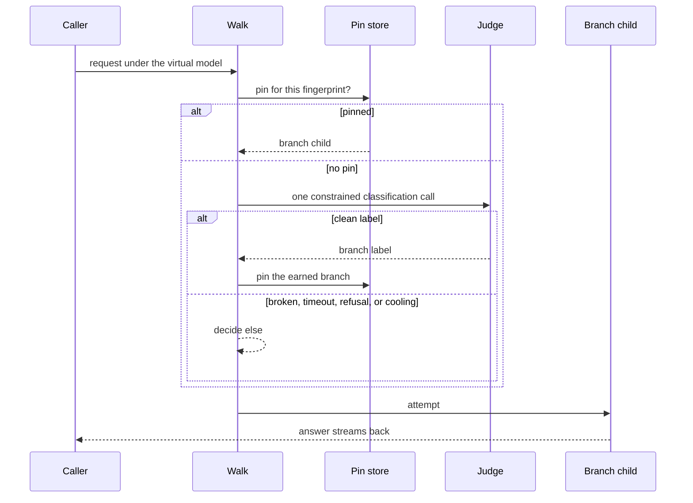

# Solution design

## Header and change linkage

- Change id: conditional-router
- Schema: recompose
- Proposal: [proposal.md](proposal.md)
- Specs: [specs/routers/spec.md](specs/routers/spec.md)
- Discovery: [discovery/](discovery/)
- Tasks: [tasks.md](tasks.md), cut from the task decomposition hooks below when implementation opens

## Context

The engine walks a stored route table until a child answers or none can. Both shipped modes pick a child synchronously: failover reads declared order, and round-robin spins a cursor. The conditional mode breaks that symmetry, because its pick waits on a network call to a judge model. The walk in `packages/engine/src/routing/attempt-walk.ts` therefore needs an async picking path that leaves the two synchronous modes untouched in behavior.

The feature lands in three places at once. The contracts package holds the stored shape every consumer reads. The engine holds the walk, the cooling rules, and the per-gateway memory. The renderer holds the canvas and the inspector, with the drawn screens 0 to 7 in `designs/recompose.pen` already merged (PR #267). The approval gates froze the proposal and its locked decisions, and this document turns them into buildable shape.

## Discovery inputs consumed

- `discovery/technical-research.md` section 1: shaped else as a named policy field the schema enforces, following the Portkey `default` precedent.
- `discovery/technical-research.md` section 2: fixed the classification transport as enum-constrained decode per dialect, with forced tool use as the fallback channel.
- `discovery/technical-research.md` section 3: replaced the `accountId` judge binding with a route-node reference, keeping account names off the engine lane.
- `discovery/technical-research.md` section 4: added the walk-scoped decision memo, so `ATTEMPT_LIMIT` can't multiply judge calls, and settled the unremembered server-state turn on else.
- `discovery/technical-research.md` section 5: placed the timeout budget in the stored policy and anchored its clock at dispatch.
- `discovery/technical-research.md` section 6: wrote the injection posture into the design: closed enum, delimited request tail, and no tail logging.
- `discovery/technical-research.md` section 7: confirmed no runtime dependency earns a place, so the judge call composes from existing engine pieces.
- `discovery/technical-research.md` section 8: bounded the pin store with an idle expiry keyed like other per-router state.
- `discovery/technical-research.md` section 9: reserved "judge" for surfaces a person reads, while docs say the judge classifies rather than evaluates.
- `discovery/acceptance-references.md` sections 1 to 3: widened the broken-answer taxonomy, excluded else from the judge's label set, and pinned the dispatch-anchored clock.
- `discovery/acceptance-references.md` sections 6 to 8: fixed the client-key-first fingerprint, made rule text provably reach the judge, and made a rename a semantic edit.
- `discovery/code-map.md`: grounded the file map below, flagged `firstDeclaredTarget` as the token-counting hazard, and named `spoken-rank.ts` as wrong for labeled branches.
- `discovery/mobbin-references.md`: consulted, no engine impact. Its canvas guidance already lives in the proposal's gap analysis.
- `discovery/rider-ledger.md`: no open rider touches this feature, so nothing constrains the design from prior deferrals.

## Goals and non-goals

**Goals:**

- A third `RouterPolicy` mode where a judge classifies each request and the walk follows the branch whose rule matches.
- Routing trouble never drops a request: judge refusal, timeout, broken answer, cooling, and no match all land on else.
- The judge resolves under the same custody, cooling, and health rules as any target, referenced by route node id.
- Conversations keep the branch they first earned, keyed by fingerprint, with a per-router re-judge toggle.
- Zero behavior change for failover and round-robin routers, proved by their untouched specs.
- The canvas and inspector behavior the drawn screens depict, built from existing theme tokens.

**Non-goals:**

- A judge-free deterministic rule mode reading regex, token counts, or headers. That mode stays a future change.
- Judge token usage attribution in the usage tables.
- Pin persistence across engine restarts. The pin store lives in per-gateway runtime memory and dies with it.
- Any change to first-byte commitment or streaming semantics.
- New color families or theme tokens. Every canvas piece composes from tokens `theme.css` already carries.

## Constraints and invariants

- TypeScript maximum strictness, verbatim from the project rules: `strict: true` plus `noUncheckedIndexedAccess`, `exactOptionalPropertyTypes`, `noImplicitOverride`, `noFallthroughCasesInSwitch`, `noPropertyAccessFromIndexSignature`. No `any`, no `as` casts to silence errors.
- "Never write code comments." The sole exception is a constraint or invariant the code genuinely can't express.
- "Test code changes if and only if behavior changes." A pure refactor must never require touching a test.
- A property law on a mutate-listed file gets a deterministic twin spec that pins the same law with fixed values.
- Feature-Sliced Design v2.1 placement per Architecture Decision Record (ADR) 0010. The gateway-canvas slice keeps its single public export.
- Every new component under a `ui/` segment owns a folder and ships its stories sibling before the branch leaves the machine.
- "Never disable, override, loosen, or silence any gate."
- `ROUTER_DEPTH_LIMIT` stays 4, so chained judges stay bounded.
- The custody invariant from `packages/contracts/src/engine-routing.ts`, verbatim: "The stored target names the account paying for it, and that name never crosses the lane."
- The first byte written downstream commits the child that wrote it, per the routers spec.

## Design

The conditional mode splits into four pieces: a stored shape, an async pick, an injected judge call, and a pinned memory.

**The stored shape.** The policy union in `packages/contracts/src/gateway-routing.ts` gains a third member. It carries the judge's route node id, the ordered branches, the named else child, the timeout budget, and the re-judge flag. Branches pair a label with a rule and name a child id. The schema's own refinements enforce the invariants: else names a child, labels stay unique and non-blank, and every named id resolves. The judge id names a target node that no `children` array holds, so the reachability refinement learns that a judge reference counts as reachable.

**The async pick.** `ChildPicker` returns `Promise<string | undefined>`, and `PICK_BY_MODE` gains a `conditional` entry. The two existing picks stay synchronous functions whose values the walk awaits, which changes no observable behavior and therefore no existing spec. `stepTheWalkTakesNext` becomes async to thread the await through its loop. The conditional pick reads the walk-scoped decision first. When no decision exists, it asks the judge once, maps the answered label to its branch child, and falls to else on any trouble. When the decided child can't serve, the pick falls through `subtreeCanServe` to else rather than asking the judge again.

**The injected judge call.** `WalkRequest` gains a `classifyBranch` dependency injected beside `attempt`, so the walk keeps knowing no transport. `gateway-proxy.ts` builds that dependency. It resolves the judge's custody through the same path a target uses and shapes a constrained classification request in the account's dialect. `AbortSignal.timeout` bounds the call with the policy's budget. The prompt hands the judge the branch labels, the rules, and the request tail, delimited so untrusted content stays marked. The label set excludes else. A cooling judge short-circuits before any call leaves the machine, read through the existing `coolingAt`. The classification answer feeds the walk and nothing else: the request tail never lands in traffic rows.

**The pinned memory.** `RoutingMemory` in `packages/engine/src/gateway-routing-memory.ts` gains a bounded pin store keyed by `RouteNodeAddress` plus conversation fingerprint. The fingerprint prefers an explicit client key and falls back to a hash of content that stays stable across turns. A hit hands the pick its branch child with no judge call. A miss judges, then pins. The re-judge flag skips the read but still writes, and an idle expiry evicts stale pins. A server-state turn never changes branch: with a pin it follows the pin, and without one it goes to else with no classification call. That extends the `wouldRotate` precedent to a second mode.



**The canvas and the inspector.** The renderer work follows the proposal's gap analysis piece by piece. The mode option and its sentence join `router-modes.ts`, and the re-judge toggle pairs with its own cost sentence. The routing edits in `routing-edits.ts` learn branch writes, the judge binding, and the undeletable else. The judge satellite becomes a focusable node with a tidy-layout offset seat, a minimap fill, and its own inspector subject. Rule pills ride the cables at the 0.35 anchor, and the branch rule sheet composes from the existing sheet shell plus one new shared textarea primitive.

## Data model and contracts

The new union member, in the shape the schema work targets:

```ts
z.strictObject({
  mode: z.literal('conditional'),
  judge: routeNodeIdSchema,
  branches: z.array(
    z.strictObject({
      label: nonBlankString,
      rule: nonBlankString,
      child: routeNodeIdSchema,
    }),
  ),
  elseChild: routeNodeIdSchema,
  judgeBoundMs: z.number().int().positive(),
  rejudgeEveryRequest: z.boolean(),
});
```

- The judge id names a `target` node in the same table. It appears in no `children` array, so declared-order walkers never meet it.
- `elseChild` and every `branches[n].child` name members of the router's `children` array, enforced by refinement.
- Labels stay unique per router after trimming, enforced by refinement, because the label is the judge's vocabulary.
- `engine-routing.ts` mirrors the policy whole, as today. The judge crosses as an id, and the parent resolves its custody per attempt against live storage.
- State transitions in the renderer: a dropped cable births a draft branch, amber until it holds a label and a rule. A conditional draft can't save until a judge binds, enforced in `model-draft.ts`.
- The pin store holds fingerprint to branch-child entries per router address, bounded by an idle expiry, forgotten on child restart like the rest of `RoutingMemory`.
- No bridge channel changes. The stored gateway document is the only contract that widens.

## Error handling

Every classification failure is a typed reading that routes, never a thrown surprise.

| Failure                                                  | Typed result             | Where it lands                                                      |
| -------------------------------------------------------- | ------------------------ | ------------------------------------------------------------------- |
| Judge answers a clean branch label                       | decided branch           | the labeled child                                                   |
| Judge answers text matching no label, twice              | broken answer            | else                                                                |
| Judge answers the word else, multiple labels, or nothing | broken answer, one retry | else after the retry                                                |
| Judge refuses (auth, rate limit, malformed)              | judge refusal            | else, and the refusal cools the judge through the existing readings |
| No answer inside `judgeBoundMs`, clock at dispatch       | judge timeout            | else                                                                |
| Judge stands cooling before the call                     | cooling short-circuit    | else, no call leaves the machine                                    |
| Judge id resolves to no usable custody                   | judge unavailable        | else                                                                |
| Decided branch subtree can't serve                       | fall-through             | else, without a second judge call                                   |

A conditional router never answers a routing refusal for trouble else can absorb. The structural refusals stay what they were: the schema makes a conditional router without else unrepresentable, so the empty-router refusal stays a failover and round-robin concern. The exhausted refusal never names the judge, because the judge isn't a child the walk tried. `gateway-walk-notes.ts` excludes the judge call from cable accounting for the same reason.

## File map

Contracts, all modify:

- `packages/contracts/src/gateway-routing.ts`: the third union member, its refinements, and `Conditional` in the mode names.
- `packages/contracts/src/gateway-routing.test.ts`: refinement specs for else, labels, judge reachability, and depth.
- `packages/contracts/src/gateway-routing-naming.test.ts`: the conditional case in both naming specs.
- `packages/contracts/src/gateway-config.test-d.ts`: the mode union type spec widens in the same commit.

Engine:

- `packages/engine/src/routing/attempt-walk.ts`: async `ChildPicker`, the conditional entry in `PICK_BY_MODE`, the decision memo, and the server-state answer for conditional (modify).
- `packages/engine/src/routing/policies.ts`: the pure branch-matching pick beside the two existing picks (modify).
- `packages/engine/src/routing/judge-decision.ts`: the decision shape: label mapping, broken-answer taxonomy, retry, and else fall-through (create).
- `packages/engine/src/routing/outcome-classification.ts`: readings for judge refusal and judge timeout that route rather than refuse (modify).
- `packages/engine/src/gateway-routing-memory.ts`: the bounded pin store with idle expiry (modify).
- `packages/engine/src/gateway-proxy.ts`: builds and injects `classifyBranch` with custody, dialect shaping, and the timeout bound (modify).
- `packages/engine/src/provider/judge-call.ts`: the one-shot constrained classification request per dialect, following the `key-probe.ts` pattern (create).
- `packages/engine/src/gateway-walk-notes.ts`: the judge call stays out of cable accounting (modify).

Renderer, gateway-canvas slice unless said otherwise:

- `lib/router-modes.ts`: the conditional option, its mode sentence, and the re-judge cost sentence (modify).
- `lib/routing-edits.ts`: branch writes, judge binding, else protection in `gatewayDroppingNode` (modify).
- `lib/model-draft.ts`: the conditional draft save gate wants a judge (modify).
- `lib/route-graph.ts` and `lib/canvas-cards.ts`: branch labels reach placed nodes and cards (modify).
- `lib/tidy-layout.ts`: the satellite seats as an offset from its router, never a column (modify).
- `lib/cable-standing.ts`: the `cooling` standing joins every exhaustive record, painted `--color-attention` (modify).
- `ui/router-node/router-node.tsx` and `ui/router-node/router-reading.ts`: the mode pill and branch wording (modify).
- `ui/judge-satellite/judge-satellite.tsx`: the round advisor node, its dotted tie, and its stories sibling (create).
- `ui/binding-cable/binding-cable.tsx`: the rule pill at the 0.35 anchor beside the midpoint failure chip (modify).
- `ui/router-inspector/router-inspector.tsx` and `ui/router-inspector/router-child-rows.ts`: judge picker, re-judge toggle, labeled rows with pin marks, inert else row (modify).
- `ui/router-child-list/router-child-list.tsx` and `ui/router-child-list/spoken-rank.ts`: labeled branch rows and label-aware announcements (modify).
- `ui/branch-rule-sheet/branch-rule-sheet.tsx`: label field, routes-to line, wide rule textarea, and stories (create).
- `ui/router-draft-fields/router-draft-fields.tsx`, `ui/routing-picker/routing-picker.tsx`, `ui/router-general-info/router-general-info.tsx`: judge fields and mode offering (modify).
- `ui/gateway-canvas-page/router-acts.ts` and `ui/gateway-canvas-page/canvas-subjects.ts`: else removal refusal and the judge subject (modify).
- `ui/subject-bodies/subject-bodies.tsx` and `ui/canvas-minimap/canvas-minimap.tsx`: the judge drawer body and the minimap fill with its dotted tie (modify).
- `apps/desktop/src/renderer/src/shared/ui/text-area/text-area.tsx`: the first multiline text primitive, with stories (create).
- `apps/desktop/e2e/features/routers/`: the frozen scenarios graduate here by directory copy (create).

## Interfaces

- Consumes: `routerPolicySchema`, `RouteNode`, `routeNodeIdSchema`, `ROUTER_DEPTH_LIMIT`, and `nameOfRouterMode` from `@recompose/contracts`. `CooldownLedger.coolingAt`, `classify`, `RouteNodeAddress`, and `turnResumesServerState` inside the engine. `SegmentedControl`, `InspectorToggle`, `TextField`, `FieldRow`, `Sheet`, `ConsequenceDialog`, and `StatusChip` from the renderer's shared kit.
- Produces, contracts: the widened `RouterPolicy` union whose `conditional` member carries `judge`, `branches`, `elseChild`, `judgeBoundMs`, and `rejudgeEveryRequest`. `nameOfRouterMode('conditional')` returns `Conditional`.
- Produces, engine: `type ChildPicker = (children, canServe, turn) => Promise<string | undefined>`. `WalkRequest` gains `classifyBranch: (judge: string, branches: readonly BranchRule[], tail: string) => Promise<JudgeReading>`. `walkAttempts` keeps its exported signature.
- Produces, renderer: no new slice exports. `GatewayCanvasPage` stays the single public surface.

## Decisions

### 1. The judge is a route node the policy references by id

The policy stores a route node id, and the engine resolves the judge's account per attempt, exactly as it resolves a target. This wins because `engine-routing.ts` exists to keep account names off the engine lane. Cooling keys by route node address, so the judge earns its cooling entry with no new machinery. Four readers learn that a judge reference is reachable without being a child: `childrenOf`, `inboundReferences`, `reachedFromEntry`, and the declared-order walkers. A spec proves token counting never resolves to the judge.

**Alternatives considered:** `accountId` inside the policy, rejected because it crosses the custody lane the contracts docstring forbids. A split engine mirror stripping the judge's account, rejected because it forks "a router mirrors whole" into two unions.

**ADR draft:** below, graduates through the `architecture-decision-records` skill during implementation.

> **Title:** The conditional router's judge is a route node under target custody, and routing trouble lands on else.
>
> **Context:** The conditional mode needs a judge model with real credentials, yet the engine child must never hold an account name. The routers spec adds a never-drop invariant: judge refusal, timeout, broken answers, cooling, and no match must not drop or refuse a request the else branch can absorb. Cooling, custody, and health already key by route node address.
>
> **Decision:** The stored policy references the judge by route node id. The judge node lives in the table without joining any `children` array, so declared-order walkers, token counting, and refusal notes never meet it. The walk memoizes one classification decision per request, with one retry. Every classification failure routes to the mandatory `elseChild`, which the schema enforces as a named field.
>
> **Consequences:** The judge inherits cooling and custody for free, and a cooling judge costs no outbound call. The reachability refinement widens to accept judge references. A refusal can never name the judge, and the caller never learns routing had trouble. The else branch becomes the observable floor of every failure mode, which the Gherkin scenarios pin.

### 2. One classification per walk, memoized

The walk asks the judge at most once per request, plus one retry inside the same decision. The decision memo lives in the walk's state, so `ATTEMPT_LIMIT` retries of failing branch children can't multiply judge calls. A decided branch whose subtree can't serve falls to else through the existing `subtreeCanServe` predicate.

**Alternatives considered:** judging on every loop pass, rejected because eight attempts could mean eight judge calls, eight spends, and a request held open seconds longer.

### 3. `ChildPicker` goes async and the sync modes wrap unchanged

The picker type widens to a promise, and failover and round-robin stay synchronous functions the walk awaits. Their specs stay untouched, which is the proof no behavior changed.

**Alternatives considered:** a second parallel async picker table beside the sync one, rejected because two dispatch tables for one decision point split one piece of knowledge in two.

### 4. The pin store lives in bounded runtime memory, client key first

Pins live in `RoutingMemory` beside cursors and cooling, keyed by router address plus fingerprint, evicted on idle expiry. An explicit client key wins over a content hash, and the hash reads only content that stays stable across turns.

**Alternatives considered:** persisting pins in the gateway document, rejected because a routing decision is runtime state, not configuration, and a restart forgetting pins matches how cursors and cooling already behave. An unbounded map, rejected because a long-running desktop process would grow it without limit.

### 5. Enum-constrained decode per dialect, forced tool use as the fallback

The classification call constrains the answer with the dialect's own enum mechanism, one string enum of branch labels, with else excluded. Channels that reject constrained output fall back to forced tool use. Prompt discipline alone isn't a constraint.

**Alternatives considered:** parsing a free-text answer, rejected because the broken-answer taxonomy then becomes the common path rather than the edge.

### 6. Else is a named policy field

`elseChild` is its own field rather than a positional convention, so the schema itself refuses a conditional router without else, and no edit can remove it.

**Alternatives considered:** "the last child is else," rejected because reordering edits could then change which child catches trouble without a trace.

### 7. A server-state turn without a pin goes to else, without a call

`wouldRotate` answers for round-robin with a refusal. The conditional mode extends the same question with a different answer: hold the pin when one exists, and go to else when none does. A refusal would contradict the never-drop invariant.

**Alternatives considered:** refusing like round-robin, rejected because the spec words are "routing failure never drops a request." Judging the turn anyway, rejected because a fresh judgment could move a sealed conversation across accounts.

## Test matrix

| Layer          | What this layer proves (or why none)                                                                                                                                                                                                                                                                                                                                                                    | Check command                                                                                                                                                     |
| -------------- | ------------------------------------------------------------------------------------------------------------------------------------------------------------------------------------------------------------------------------------------------------------------------------------------------------------------------------------------------------------------------------------------------------- | ----------------------------------------------------------------------------------------------------------------------------------------------------------------- |
| Unit           | Contracts: the refinements refuse a missing else, duplicate labels, an unresolvable judge, and depth past the cap, and naming returns `Conditional`. Engine: the pure branch pick, the decision memo, the broken-answer taxonomy, cooling and timeout landing on else, pin expiry, and the server-state answers. Renderer: branch edits, else protection, the save gate, and label-aware announcements. | `pnpm --filter @recompose/contracts run test`, `pnpm --filter @recompose/engine run test`, `pnpm --filter @recompose/desktop run test`                            |
| Integration    | `gateway-proxy` serves a conditional table end to end with transports doubled at the network boundary: judged traffic reaches the labeled child, trouble lands on else, the second turn skips the judge, and the judge call carries labels and rules with else excluded.                                                                                                                                | `pnpm --filter @recompose/engine run test`                                                                                                                        |
| End-to-end     | The frozen scenarios in `gherkin/routers/` graduate to `apps/desktop/e2e/features/routers/` and run against the built app.                                                                                                                                                                                                                                                                              | `pnpm run build && pnpm run test:e2e`                                                                                                                             |
| Property       | Laws with fast-check: every possible judge reading maps to exactly one child and unknown labels map to else, the pin store never exceeds its bound, and prompt assembly preserves branch order and delimits the tail. Each law on a mutate-listed file gets a deterministic twin spec pinning the same law with fixed values.                                                                           | `pnpm --filter @recompose/engine run test`                                                                                                                        |
| Mutation scope | The diff-scoped Stryker gate covers the mutate-listed changes in contracts, engine, and the desktop renderer libraries, at the committed thresholds. No threshold moves.                                                                                                                                                                                                                                | `pnpm --filter @recompose/contracts run test:mutation`, `pnpm --filter @recompose/engine run test:mutation`, `pnpm --filter @recompose/desktop run test:mutation` |

## Task decomposition hooks

- Task 1: contracts variant and naming (depends on: none, hands off: the widened `RouterPolicy` union through the barrel). Owns the four contracts files.
- Task 2: engine walk and pure pick (depends on: task 1, hands off: async `ChildPicker` and the `classifyBranch` signature on `WalkRequest`). Owns `attempt-walk.ts`, `policies.ts`, `judge-decision.ts`, and `outcome-classification.ts`.
- Task 3: engine judge call, proxy injection, and pins (depends on: tasks 1 and 2, hands off: a serving gateway whose conditional routers judge, pin, and fall to else). Owns `gateway-proxy.ts`, `provider/judge-call.ts`, `gateway-routing-memory.ts`, and `gateway-walk-notes.ts`.
- Task 4: renderer inspector cluster (depends on: task 1, hands off: a conditional router a person can configure end to end). Owns `router-modes.ts`, `routing-edits.ts`, `model-draft.ts`, the router-inspector, router-child-list, router-draft-fields, router-general-info, and routing-picker folders, the branch-rule sheet, and the shared textarea.
- Task 5: renderer canvas cluster (depends on: task 1, hands off: the drawn canvas language on screen). Owns `route-graph.ts`, `canvas-cards.ts`, `tidy-layout.ts`, `cable-standing.ts`, the router-node, binding-cable, judge-satellite, canvas-minimap, subject-bodies folders, `router-acts.ts`, and `canvas-subjects.ts`.
- Task 6: graduation and looking (depends on: tasks 2 to 5, hands off: the merged feature verified in the running app). Owns `apps/desktop/e2e/features/routers/` additions and the browser verification pass in both schemes.

Tasks 2 and 3 run in sequence because task 3 consumes the signature task 2 hands off. Tasks 4 and 5 run in parallel with each other and with tasks 2 and 3: their file sets are disjoint, and each dispatch names the files it owns.

## Risks

- [Risk] The async picker ripples into failover and round-robin behavior. → Mitigation: both picks stay synchronous functions, and their untouched specs are the regression proof.
- [Risk] The judge leaks into declared order, so token counting or refusal notes bill or name it. → Mitigation: the judge joins no `children` array, and a contracts spec plus an engine spec pin the exclusion.
- [Risk] A subscription channel strips constrained-output fields and the judge answers prose. → Mitigation: the broken-answer taxonomy absorbs it through retry then else, and the inspector can say a channel can't constrain output.
- [Risk] The first call after a rule edit pays a grammar-compilation penalty and busts the budget. → Mitigation: the budget is per-router configuration, and the timeout lands on else rather than dropping the request.
- [Risk] A crafted request tail steers the judge to an expensive branch. → Mitigation: the closed enum can't name a branch outside the set, the tail rides delimited, and the tail never lands in traffic rows.
- [Risk] The pin map grows without bound in a long-lived process. → Mitigation: idle expiry plus the property law pinning the bound.
- [Risk] The satellite collides with the row above at tight pitches. → Mitigation: the tidy seat is an offset rule owned by `tidy-layout.ts`, checked in the browser pass before landing.

## Migration and rollout

- The union member is additive. Every stored gateway document parses unchanged, because discriminated unions ignore members they don't use.
- No data migration runs. A document gains the variant only when a person switches a router to conditional.
- Rollback before any router switches is free. After a switch, an older build refuses the document at parse, so the release notes name the one-way door.
- The feature ships in the ordinary desktop release train behind no flag: an unswitched router behaves exactly as before.

## Open questions

- Does a judge timeout cool the judge, or does only a provider refusal cool it? The scenarios pin only that a cooling judge lands on else, so the cooling trigger can settle during implementation.
- The idle expiry magnitude for pins. The research bounds the useful window between five minutes and an hour, and the constant can settle with local measurement.
- Whether a branch rename invalidates existing pins. The frozen scenarios assert only the vocabulary change on a fresh conversation.
- The editor wording when a person types a duplicate or reserved label. The refinement refuses it either way.
- The inspector wording for a judge whose channel can't constrain output.

## End-to-end verification

Run the desktop app, bind a virtual model to a conditional router with a `code` branch, a `chat` branch, and else, and bind a cheap judge. Send one code request and one chat request through the gateway. The canvas shows each judged branch pulsing live and cooling to rest, and the satellite rides above the router in both schemes. A second turn on the same conversation reaches its earned branch, and the traffic rows show no judge call. Rate-limit the judge and send again: the request lands on else, the satellite wears the attention chip, and the caller sees a normal answer.

A fresh-context reviewer diffs the result against the frozen spec delta, the frozen Gherkin set, and the locked decisions in the proposal. The review also checks the browser pass covered both color schemes.
