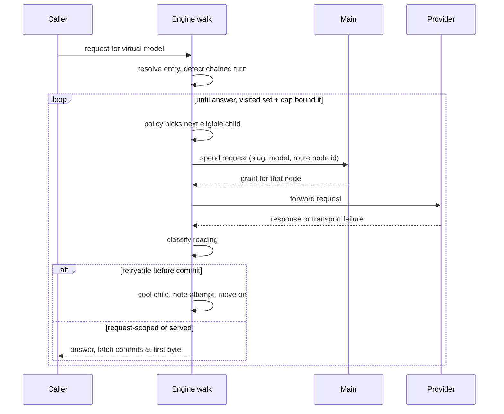

# Gateway routers solution design

## Header and change linkage

- Change id: gateway-routers
- Schema: recompose
- Proposal: [proposal.md](./proposal.md)
- Specs: [specs/routers/spec.md](./specs/routers/spec.md)
- Discovery: [discovery/](./discovery/)
- Tasks: None. Gate 3 derives tasks.md from the task decomposition hooks below.

## Context

A virtual model binds exactly one target today. The gate-1 proposal locked eighteen decisions that put a chainable router between a virtual model and its targets, with `failover` and `round-robin` as the two shipped modes. Nothing below reopens them. This document turns them into mechanics an implementer can build without reinterpretation. It fixes the stored schemas, the version 3 migration, the protocol seam, the attempt walk, the three refusals, the renderer work, the test matrix, and the task clusters.

The design also closes the seven questions the proposal left open for gate 2. It drafts the two Architecture Decision Record (ADR) entries the change owes. One records the router design, and one records the AIMock adoption rider #140 asked for. The implementation order in `docs/adr/0081-router-engine-parity-is-deferred-with-a-source-map.md` binds the build sequence, and the task hooks below follow it step by step.

## Discovery inputs consumed

- `discovery/code-map.md`: supplied the file inventory every section below cites, including the seven side-path readers of `virtual.target`. It fixed the file map and the task ownership lists.
- `discovery/technical-research.md` finding 2 (zod hazard): moved the stored shape to an id-keyed table, which proposal decision 4 locked. The schemas below use `z.discriminatedUnion` because no schema recurses.
- `discovery/technical-research.md` finding 3 (custody seam): shaped the protocol decision. The route node id crosses as a seat name and `accountId` stays in main.
- `discovery/technical-research.md` finding 4 (classification): named `plugin-abi.ts` and `subscription/codex-errors.ts` as the normalizers the classification table consumes, and flagged the two-form `Retry-After` parse.
- `discovery/technical-research.md` findings 5 and 6 (cooldown and cursor): set the refusal-over-panic stance, the retry time on the exhausted refusal, filter-before-select, and the cursor key.
- `discovery/technical-research.md` finding 9 (libraries): confirmed no runtime dependency enters. The two policies are small pure functions.
- `discovery/session-spikes.md`: proved the recursive schema fails on zod 4.4.3 and that a flat table sidesteps it. It also proved cyclic input crashes a recursive parse, which makes the contracts walk a safety boundary rather than a nicety.
- `discovery/acceptance-references.md`: pinned the commit boundary at the first downstream byte, enumerated the retryable statuses from first-party sources, and split the streaming failure into three cases. Decision 5 below carries the split.
- `discovery/rider-ledger.md`: folded four rider items into the file map (#155 refusal wording, #155 `withXaiRetryAfter` rename, #155 chip anchoring, #154 furniture amendment) and confirmed #140 as the decision that owes a record. The design consulted #153 and took no impact from it, since it aids debugging only. Decision 6 answers the question #138 raises about a time bound's home.
- `discovery/mobbin-references.md`: shaped the inspector layout (mode control on top, children below) and the ladder rows (printed rank, drag handle, panel-not-canvas reorder).
- `discovery/candidate-contracts-first.md`, `discovery/candidate-failure-first.md`, `discovery/candidate-minimal.md`: consulted, no impact. The proposal already settled the pick and absorbed the losers' surviving judgments.
- `discovery/acceptance-references.md` criterion 14 and `discovery/session-spikes.md` route confirmation: made the chained-turn refusal a live requirement, since `/v1/responses` serves downstream today.

## Goals and non-goals

**Goals:**

- Give every locked proposal decision its concrete shape: exact schemas, signatures, module boundaries, and numbers.
- Close the seven gate-2 questions inside the decisions section, so nothing reopens at implementation.
- Define the five-layer test matrix, the mutate list, and the property laws with their deterministic twins.
- Cut the work into task clusters with disjoint file ownership, so gate 3 derives tasks without reinterpretation.
- Draft the two ADRs inline: the router design record and the AIMock adoption record.

**Non-goals:**

- The six deferred modes (#33, #43, #44, #45, #46, #47). The `policy` union is their seam, and none of their machinery lands.
- Session affinity in any form. A chained turn under round-robin refuses, and it never pins (proposal decision 13).
- Failure counting, escalating cooldown windows, or any health model beyond one cooldown per refusal (proposal decision 11).
- Mid-stream continuation or resumption. After the commit point the provider's stream error forwards verbatim.
- A bigger-window fallback for context-length failures. They stay request-scoped, and the omission is a decision (proposal decision 7).
- Cooldown or cursor state that survives an engine restart. Memory flushes with the process.
- Canvas-wide undo. The reorder gesture ships without undo, consistent with the archived canvas decision 9.

## Constraints and invariants

- TypeScript strictness, verbatim from the project rules: "Maximum strictness, always: `strict: true` plus `noUncheckedIndexedAccess`, `exactOptionalPropertyTypes`, `noImplicitOverride`, `noFallthroughCasesInSwitch`, `noPropertyAccessFromIndexSignature`." Also: "No `any`, no `as` casts to silence errors."
- Comments, verbatim: "Never write code comments. Code must explain itself through naming and structure." The `@summary` docstring pattern on exported declarations stays, as API documentation.
- Feature-Sliced Design (FSD) v2.1 bounds every renderer file. Verbatim: "Every component under a `ui/` segment owns a folder: `ui/<component-name>/<component-name>.tsx`" and "A new component under a `ui/` segment ships its `*.stories.tsx` sibling before the branch leaves your machine."
- Gates, verbatim: "Never disable, override, loosen, or silence any gate." The mutation thresholds, coverage, prose, and spelling gates all stand as they are.
- The Test-Driven Development (TDD) invariant, verbatim: "Test code changes if and only if behavior changes." The protocol type specs rewrite exactly where the contracts change, which the invariant permits.
- The mutation rule, verbatim: "A property test never carries mutation duty alone." Every property law below names its deterministic twin.
- The engine child never holds a credential or an `accountId`. The assertion at `packages/contracts/src/engine-protocol.test-d.ts:152` stands untouched.
- Accessibility, verbatim: "every drag gesture keeps a single-pointer and keyboard twin," per Web Content Accessibility Guidelines (WCAG) 2.2 success criterion 2.5.7.
- Screen work, verbatim: "Anything that reaches the screen gets looked at through `claude-in-chrome`, in both schemes, before it lands."
- Prose: no em dash anywhere, and every authored markdown file passes the Vale and cspell gates.

## Design

The feature is one data shape, one walk, and one new card.

**The data shape.** A virtual model stops binding a single target. It binds a `routing` value holding an entry id and an id-keyed table of route nodes. A node is a target or a router, and a router names its children by id. Because children are string references, no schema recurses, the zod defect never engages, and a parsed cycle is structurally impossible. A `superRefine` walk proves the table servable at parse time. The entry resolves, every child resolves, no node has two parents, no node stands unreachable, and routers nest at most four deep. The stored document moves to version 3. The migration rewrites each direct target into the one-node graph that serves identically.

**The walk.** The engine resolves the entry once per request and then walks attempts. At a router it asks the mode's pure policy function for the next eligible child. At a target it asks main for a grant by route node id, forwards upstream, and classifies what came back. A retryable reading cools that child, records the attempt, and moves on. A request-scoped reading answers the caller. The walk terminates structurally: a visited set forbids a second attempt at any node, and an attempt cap bounds the total. The commit latch closes the walk the moment the first byte reaches the caller.



**The card.** The canvas gains a fourth node kind. The router card keeps the 184 by 88 footprint and the four-slot grammar inside a chamfered frame whose left and right edges come to a point. It draws its border twice in the router tint, at the 1.5 pixel weight the `node-card` utility sets. Seating derives from routing depth, so a composition without a router keeps every seat it has today. The inspector owns the mode control and the ordered child list. The canvas owns only binding.

**How the build honors the ADR-0081 implementation order.** Step 1 is this change. Step 2 is the version 3 migration (task 1). Step 3 is the contracts walk (task 1). Step 4 is the credential-free node table and per-attempt custody (tasks 2 and 5). Step 5 puts the pure policy functions before any mutable state, so task 3 builds `policies.ts` before `cooldown-ledger.ts`. Step 6 keys cooldown and the cursor by gateway, virtual model, and route node id, never by the client alias. Step 7 stays where it lives: the subscription transport refreshes an unauthorized credential once before the walk classifies. Step 8 is the classification table. Step 9 is the commit latch. Step 10 holds: no deferred mode lands, and the `policy` union is their future seam.

**Trade-offs in view.** The flat table trades a little read convenience for parse safety and future-mode fit. Every reader resolves ids through one shared module instead of walking a nested value. The commit latch trades a one-event hold on streams for correct failover, which the no-buffering constraint permits because relay resumes right after classification. Depth-derived seating trades a fixed column map for a computed one, which keeps existing gateways pixel-stable, at the cost of a bigger `tidy-layout.ts`.

## Data model and contracts

**A correction on the version number.** This document assumed a tree storing version 2, so it says version 3 throughout. The gateway API key change landed first and took 3 with an identity restamp, so the router change stores **version 4** and registers a `from: 3` entry. Every "version 3" below reads as "the version this change stores." Nothing else moves: the 2-to-3 step rewrites nothing, so a stored version 2 document still climbs the ladder and serves what it served.

### Stored shape, `packages/contracts/src/gateway-config.ts`

```ts
export const GATEWAY_CONFIG_VERSION = 4;

export const routeNodeIdSchema = nonBlankString;

export function mintRouteNodeId(): string {
  return crypto.randomUUID();
}

export const routerPolicySchema = z.discriminatedUnion('mode', [
  z.strictObject({ mode: z.literal('failover') }),
  z.strictObject({ mode: z.literal('round-robin') }),
]);

export const routeNodeSchema = z.discriminatedUnion('kind', [
  z.strictObject({
    kind: z.literal('target'),
    accountId: nonBlankString,
    providerModel: nonBlankString,
  }),
  z.strictObject({
    kind: z.literal('router'),
    displayName: nonBlankString.optional(),
    policy: routerPolicySchema,
    children: z.array(routeNodeIdSchema),
  }),
]);

export const ROUTER_DEPTH_LIMIT = 4;

export const routingSchema = z
  .strictObject({
    entry: routeNodeIdSchema,
    nodes: z.record(routeNodeIdSchema, routeNodeSchema),
  })
  .superRefine(routingServesFromItsEntry);

export const virtualModelSchema = z.strictObject({
  id: modelAliasSchema,
  displayName: nonBlankString,
  routing: routingSchema,
});
```

The schema drops the `target` field. A direct binding is the one-node graph whose entry names a target node. No direct-or-graph union exists, so no document can stand half migrated (proposal decision 5). Deferred modes later join `routerPolicySchema` as new arms carrying their own fields, with no second migration.

`children` allows an empty array on purpose. A router holding no child saves without complaint and refuses at request time, per the spec's empty-router requirement and decision 11 below.

### The `superRefine` walk

`routingServesFromItsEntry` runs one iterative walk from `entry` with an explicit stack, a visited set, and a parent count per id. It raises a `z.ZodIssue` naming the offending node id for each violation:

1. **Dangling entry**: `entry` names no key in `nodes`.
2. **Dangling child**: a router's child id names no key in `nodes`.
3. **Two parents**: a node id appears in more than one `children` array, or appears both as the entry and as a child. Every node has exactly one inbound reference, which is the node-id uniqueness proof, and it makes the shape a tree.
4. **Unreachable node**: a key in `nodes` the walk never visits. The table holds exactly what the entry reaches, so no dead nodes accumulate.
5. **Depth**: more than `ROUTER_DEPTH_LIMIT` routers stand on any path from the entry.

Acyclicity follows from rules 3 and 4. With one inbound reference per node and none into the entry, a cycle can't close. The walk is iterative, so no input can overflow the stack, which answers the spike's crash finding. The walk sits in contracts, ahead of any canvas guard, per ADR-0081 rule 3. The canvas adds its own `isValidConnection` guard for immediacy, but the engine safety boundary is this parse.

### Migration, version 2 to version 3

One new entry registers beside the existing one in `gatewayConfigMigrations`:

```ts
const directTargetBecomesOneNodeGraph: Migration = {
  from: 2,
  migrate: (doc) => /* each virtualModel: { id, displayName, routing:
    { entry: mintRouteNodeId(), nodes: { [entry]: { kind: 'target', ...target } } } } */
};
```

`packages/contracts/src/migration.ts` doesn't change. The ladder mechanism already runs any registered entry. The migration touches only `schemaVersion` and each virtual model's binding. Layout, port, slug, and display names pass through untouched, and no stored position moves (decision 12 explains why none needs to). The round-trip proof lives in `gateway-config-migration.test.ts`. A version 2 document loads and parses under the version 3 schema. The minted engine view then serves the same `accountId` and `providerModel` per virtual model as before.

### Engine mirror, `packages/contracts/src/engine-protocol.ts`

The engine's view mirrors the table with every `accountId` erased. The existing bound-or-removed standing moves inside the target arm:

```ts
const engineRouteNodeSchema = z.discriminatedUnion('kind', [
  z.strictObject({ kind: z.literal('target'), standing: targetStandingSchema }),
  z.strictObject({
    kind: z.literal('router'),
    displayName: nonBlankString.optional(),
    policy: routerPolicySchema,
    children: z.array(routeNodeIdSchema),
  }),
]);

export const engineRoutingSchema = z.strictObject({
  entry: routeNodeIdSchema,
  nodes: z.record(routeNodeIdSchema, engineRouteNodeSchema),
});

export const engineVirtualModelSchema = z.strictObject({
  id: gatewaySlugSchema,
  displayName: nonBlankString,
  routing: engineRoutingSchema,
});
```

The `keyof EngineVirtualModel` spec rewrites from `'id' | 'displayName' | 'target'` to `'id' | 'displayName' | 'routing'`. That's a contract change with its spec change, which the invariant permits. The credential assertions, including `not.toHaveProperty('accountId')` at line 152, stand exactly as written.

### The spend lane

```ts
export const engineSpendRequestSchema = z.strictObject({
  kind: z.literal('spend-request'),
  id: directiveIdSchema,
  slug: gatewaySlugSchema,
  virtualModel: gatewaySlugSchema,
  routeNode: routeNodeIdSchema,
});
```

`SpendGrantFor` in `packages/engine/src/gateway-proxy.ts` grows the seat name as its third argument:

```ts
export type SpendGrantFor = (
  slug: string,
  virtualModel: string,
  routeNode: string,
  context?: SpendGrantContext,
) => Promise<SpendGrant>;
```

Main resolves the grant per attempted node: `resolveSpendGrant` looks up `routing.nodes[routeNode]`, requires the target kind, and resolves custody for that node's `accountId`. A missing node, a router-kind node, or a vanished account answers `missing-target` or `missing-credential` as today. Only main turns a seat name into a credential, ADR-0081 rule 4 verbatim.

### Traffic attribution

The traffic report and the traffic record both grow per-attempt node identity:

```ts
export const engineTrafficReportSchema = z.strictObject({
  kind: z.literal('traffic'),
  slug: gatewaySlugSchema,
  virtualModel: gatewaySlugSchema,
  routeNode: routeNodeIdSchema,
  request: requestOutcomeSchema,
});

export const gatewayTrafficSchema = z.record(
  gatewaySlugSchema,
  z.record(gatewaySlugSchema, z.record(routeNodeIdSchema, requestOutcomeSchema)),
);
```

`NoteTraffic` in `packages/engine/src/gateway-traffic.ts` becomes `(slug, virtualModel, routeNode, request) => void`. The walk notes each failed attempt against its node at move-on time, and the serving attempt resolves as today from the final answer. One request over two children paints both cables: the failed child's outcome and the answering child's success (proposal decision 14). `logRowSchema` in `packages/contracts/src/engine-logs.ts` already carries optional `accountId` and `providerModel`. Log rows therefore attribute attempts without a shape change, and `engine-logs.ts` doesn't change.

## Error handling

Every expected failure is a typed value that drives routing. Nothing throws across the walk except `InvalidJsonBodyError`, which is the caller's own malformed body and precedes any attempt.

### The attempt reading and its verdict

The transport layer hands the walk one of these readings per attempt. The catch-and-null at `gateway-proxy.ts:256` dies. A status-less failure constructs the transport arm before any status logic runs, so the compiler checks exhaustiveness. That closes the shape of CLIProxyAPI#2189 (proposal decision 9).

```ts
export type AttemptReading =
  | { kind: 'transport-failure' }
  | { kind: 'grant-missing-credential' }
  | { kind: 'refused'; status: number; retryableHint?: boolean; coolUntil?: number }
  | { kind: 'stream-error-before-commit'; equivalentStatus: number; coolUntil?: number }
  | { kind: 'served' };

export type AttemptVerdict = { verdict: 'move-on'; coolUntil: number } | { verdict: 'answer' };
```

### The classification table, as data

One exported table in `packages/engine/src/routing/outcome-classification.ts` maps readings to verdicts. Inputs arrive normalized by `packages/engine/src/plugin-abi.ts` and `packages/engine/src/subscription/codex-errors.ts`. The table never re-parses a vendor body (proposal decision 7).

| Reading                                                                  | Verdict | Cooldown source               |
| ------------------------------------------------------------------------ | ------- | ----------------------------- |
| Transport failure, no status                                             | Move on | Default                       |
| Grant answered missing-credential for this child                         | Move on | Default                       |
| Normalized hint says retryable, any status                               | Move on | Provider signal, else default |
| Normalized hint says not retryable, any status                           | Answer  | None                          |
| Status 429                                                               | Move on | Provider signal, else default |
| Status 408, 500, 502, 503, 504, 529                                      | Move on | Default                       |
| Stream error before commit with a retryable equivalent status            | Move on | Provider signal, else default |
| Stream error before commit with any other equivalent status              | Answer  | None                          |
| Status 400, 401, 402, 403, 404, 409, 413, 422, and every unlisted status | Answer  | None                          |
| Served                                                                   | Answer  | None                          |

Notes the table's spec pins: a 401 on a subscription child classifies after the transport's single refresh, which already exists and satisfies ADR-0081 rule 7. Context-length failures, invalid tool schemas, and thinking-signature failures all surface as 400-class statuses and therefore answer, per ADR-0081 rule 8. A missing credential moves on, so one dead credential never poisons a sibling (proposal decision 6, the repair for CLIProxyAPI#3317).

### Cooldown

`routing/cooldown-signal.ts` parses the provider's own timing into an absolute `coolUntil`. It accepts `Retry-After` as delay-seconds or as an HTTP-date, and it accepts the `anthropic-ratelimit-*-reset` timestamps. Absent a signal, the default of decision 6 applies. `routing/cooldown-ledger.ts` holds the state in a module-level map keyed by `slug`, `virtualModel`, and `routeNode`. The engine child is a `utilityProcess`, so a restart forgets everything, which is the stated intent (proposal decision 11). The exhausted refusal always emits delay-seconds, whatever form arrived.

### The three refusals

`TranslationRefusal` in `packages/engine/src/refusals.ts` gains three arms, built by three constructors:

```ts
| { reason: 'empty-router'; displayName: string; model: string; routerName: string }
| {
    reason: 'exhausted-router';
    displayName: string;
    model: string;
    routerName: string;
    attempts: readonly { child: string; why: string }[];
    retryAtMs?: number;
  }
| { reason: 'chained-turn'; displayName: string; model: string; routerName: string }
```

- **Empty router**: status 502, code `empty_router`, Anthropic type `api_error`, joining the config-fault family beside `missing-target`. The message names the router and the virtual model.
- **Exhausted router**: status 429 with a `Retry-After` header when every attempted child carries a retry time, status 502 otherwise (decision 9). The message enumerates every child the walk attempted, each with its reason, and names the earliest retry time when one exists.
- **Chained turn**: status 400, code `chained_turn`, Anthropic type `invalid_request_error`. The message names the round-robin router and carries the remedy sentence: switch this router to failover, or start a conversation that doesn't resume server-side state.

`RenderedRefusal` in `packages/engine/src/refusal-wire.ts` widens with an optional retry time:

```ts
export type RenderedRefusal = {
  status: number;
  retryAfterSeconds?: number;
  body: AnthropicRefusal | OpenAiRefusal | ResponsesRefusal | GeminiRefusal;
};
```

`refusalResponse` in `packages/engine/src/gateway-wire.ts` writes the `Retry-After` header from that field, as delay-seconds, at the one place a rendered refusal becomes a `Response`. The retry time is a fact of the refusal, not of the dialect (proposal decision 12). `OpenAiCode` gains `empty_router`, `exhausted_router`, and `chained_turn`.

Rider #155 folds in here: the `missing-credential` arm gains an optional child name, so the refusal says where in the chain it stopped rather than naming only the gateway.

### Refusal fidelity

A refusal that originated upstream reaches the caller byte-identical once the walk answers it. Only refusals recompose itself originates wear the recompose shape. The commit latch guarantees the post-commit case: the provider's stream error forwards verbatim and the stream closes.

## File map

Contracts package, shared across main, engine, and renderer, outside FSD:

- `packages/contracts/src/gateway-config.ts`: route table schemas, version 3, migration entry, minting rule (modify)
- `packages/contracts/src/gateway-config.test-d.ts`: pins the derived `RouteNode` and `Routing` types (modify)
- `packages/contracts/src/gateway-config-targets.test.ts`: binding behavior specs move from `target` to `routing` (modify)
- `packages/contracts/src/gateway-config-migration.test.ts`: the version 2 to 3 round-trip proof (modify)
- `packages/contracts/src/engine-protocol.ts`: engine routing mirror, spend request seat name, traffic report node identity (modify)
- `packages/contracts/src/engine-protocol.test-d.ts`: `keyof` rewrites, and the credential assertions stand (modify)
- `packages/contracts/src/engine-traffic.ts`: three-level traffic record (modify)
- `packages/contracts/src/engine-traffic.test-d.ts`: pins the widened record (modify)

Engine package, node serving path, outside FSD:

- `packages/engine/src/routing/route-table.ts`: pure readers over `EngineRouting`: entry resolution, first declared target, reachable targets (create)
- `packages/engine/src/routing/policies.ts`: the pure failover and round-robin selection functions (create)
- `packages/engine/src/routing/outcome-classification.ts`: the reading-to-verdict table as data (create)
- `packages/engine/src/routing/cooldown-signal.ts`: two-form `Retry-After` and reset-header parsing into `coolUntil` (create)
- `packages/engine/src/routing/cooldown-ledger.ts`: in-memory cooldown state keyed by slug, virtual model, and route node (create)
- `packages/engine/src/routing/attempt-walk.ts`: the walk: visited set, attempt cap, policy dispatch, verdict handling (create)
- One `*.test.ts` sibling per created file above (create)
- `packages/engine/src/gateway-proxy.ts`: the walk replaces the single attempt, and the typed transport reading replaces catch-and-null (modify)
- `packages/engine/src/gateway-request-crossing.ts`: resolves the graph entry and detects a chained turn (modify)
- `packages/engine/src/gateway-stream-answers.ts`: the commit latch around `translatedStreamBody` (modify)
- `packages/engine/src/gateway-wire.ts`: `refusalResponse` writes `Retry-After` from the rendered refusal (modify)
- `packages/engine/src/gateway-traffic.ts`: `NoteTraffic` carries the route node, plus per-attempt failure notes (modify)
- `packages/engine/src/refusals.ts`: three new arms, and the credential refusal names the child (modify)
- `packages/engine/src/refusals.test.ts`: the new arms' rendering specs (modify)
- `packages/engine/src/refusal-wire.ts`: `RenderedRefusal` widens, and `OpenAiCode` grows three codes (modify)
- `packages/engine/src/gateway-discovery.ts`: the listing survives a router-bound model (modify)
- `packages/engine/src/gateway-count-tokens.ts`, `gateway-images.ts`, `gateway-videos.ts`, `gateway-codex-compact.ts`, `gateway-codex-alpha-search.ts`, `provider/xai-websocket-prepare.ts`: side paths resolve through `firstDeclaredTarget` (modify)
- `packages/engine/src/gateway-app.ts`, `engine-runtime.ts`, `gateway-websocket.ts`, `engine-child.ts`, `engine-child-lanes.ts`: the `SpendGrantFor` signature and the spend lane carry the seat name through (modify)
- `packages/engine/src/provider/xai-response.ts` and `provider/xai-response.test.ts`: the #155 rename of `withXaiRetryAfter` (modify)

Main process, Electron host, outside FSD:

- `apps/desktop/src/main/engine-host/stored-gateway.ts`: mints the engine routing node by node, erasing accounts (modify)
- `apps/desktop/src/main/engine-host/spend-grant.ts`: resolves a grant per attempted node (modify)
- `apps/desktop/src/main/engine-host/engine-spend.ts`: the resolver type carries the seat name (modify)
- Their sibling specs, including `engine-host-spend.test.ts` and `engine-spend.test.ts` (modify)

Renderer, pages layer, slice `gateway-canvas`:

- `lib/node-graph.ts`: the `router` node kind, per-node cables, traffic memory keyed per route node (modify)
- `lib/tidy-layout.ts`: depth-derived seating, `childSeatBeside`, adjacent-row child grouping (modify)
- `lib/model-draft.ts`: graph edits: bind a router, add a child, reorder, set mode (modify)
- `lib/log-scope.ts`: the fourth subject kind (modify)
- `model/served-models.ts`: derives the served list across the routing table (modify)
- Their sibling specs (modify)
- `ui/router-node/router-node.tsx` and `ui/router-node/router-node.stories.tsx`: the chamfered card (create)
- `ui/router-child-list/router-child-list.tsx` and `ui/router-child-list/router-child-list.stories.tsx`: the ordered ladder (create)
- `ui/gateway-stage/gateway-stage.tsx`: registers the router node type and the canvas cycle guard (modify)
- `ui/drop-picker/drop-picker.tsx`: the kind ask precedes the account and model pick (modify)
- `ui/subject-bodies/subject-bodies.tsx`: the `routerBody` sibling (modify)
- `ui/gateway-drawer/gateway-drawer.tsx`: the router subject joins the dispatch (modify)
- `ui/model-general-info/model-general-info.tsx`: a bound router replaces the single-target reading (modify)
- `ui/cable-failure-chip/cable-failure-chip.tsx`: the reveal anchors below the chip with no flipping, per #155 (modify)

Renderer, app layer:

- `apps/desktop/src/renderer/src/app/styles/primitives.css`: the router ramp on the free hue the design project authors (modify)
- `apps/desktop/src/renderer/src/app/styles/theme.css`: the `--color-router` and `--color-router-ink` pair and the `node-tint-router` hookup (modify)

End-to-end suite, outside FSD:

- `apps/desktop/e2e/features/virtual-models/targets.feature`: router binding, failover, and round-robin scenarios (modify)
- `apps/desktop/e2e/features/gateway-canvas/cable-wiring.feature`: a cable meets a router, and the kind ask (modify)
- `apps/desktop/e2e/features/gateway-canvas/furniture.feature`: the amendment from #154, opening from a router-bearing composition (modify)
- `apps/desktop/e2e/steps/virtual-models-targets.steps.ts`, `steps/gateway-canvas-cable-wiring.steps.ts`, `steps/gateway-canvas-furniture.steps.ts`: the matching steps (modify)
- `apps/desktop/e2e/fixtures.ts`: AIMock as a worker-scoped fixture on an ephemeral port, beside the existing stubs (modify)
- `apps/desktop/package.json`: `@copilotkit/aimock` as a dev dependency, pinned exact (modify)

Decision records, at implementation:

- `docs/adr/0104-the-router-walks-an-id-keyed-node-table.md`: from the draft below (create)
- `docs/adr/0105-the-serving-path-e2e-suite-adopts-aimock.md`: from the draft below (create)
- `docs/adr/README.md`: index rows for both (modify)

## Interfaces

**Contracts to everyone:**

- Produces: `routingSchema`, `routeNodeSchema`, `routerPolicySchema`, `routeNodeIdSchema`, `ROUTER_DEPTH_LIMIT`, `mintRouteNodeId(): string`, `GATEWAY_CONFIG_VERSION = 4`, and the inferred `Routing`, `RouteNode`, `RouterPolicy` types.
- Produces: `engineRoutingSchema`, the widened `engineVirtualModelSchema`, `engineSpendRequestSchema` with `routeNode`, `engineTrafficReportSchema` with `routeNode`, and the three-level `gatewayTrafficSchema`.

**Engine routing core to the serving path:**

- Produces: `classify(reading: AttemptReading, now: number): AttemptVerdict`.
- Produces: `nextFailoverChild(children, visited, coolingAt): string | undefined` and `nextRoundRobinChild(children, visited, coolingAt, cursor): { child: string | undefined; cursor: number }`.
- Produces: `walkAttempts(routing, deps): Promise<Response>` where `deps` carries the grant resolver, the forwarder, the ledger, the note hook, and the clock.
- Produces: `firstDeclaredTarget(routing): EngineRouteTarget | undefined` for every side path.
- Consumes: `SpendGrantFor` with the seat name, `translatedStreamBody`, the refusal constructors, and the cooldown signal parser.

**Engine to main, over the spend lane:**

- Consumes: `resolveSpendGrant(ctx, slug, virtualModel, routeNode): Promise<SpendGrant>` in `apps/desktop/src/main/engine-host/spend-grant.ts`, surfaced to the child through `SpendGrantFor` in `engine-host/engine-spend.ts`.

**Engine to renderer, over traffic:**

- Produces: one traffic report per attempt, keyed by route node, which `lib/node-graph.ts` folds into per-cable standings.

**Renderer internals:**

- Produces: the `router` arm of `CanvasNode`: `{ id, kind: 'router', modelId, routeNodeId, mode, displayName, childCount }`, with node ids namespaced `route:<virtualModel>:<routeNodeId>` and target ids widened to carry their route node id.
- Produces: `childSeatBeside(parentSeat: XY): XY` replacing `targetSeatBeside`, and a `seatForNewNode` that takes a column position rather than a closed kind map.
- Consumes: `SegmentedControl` from `shared/ui/segmented-control` for the mode, and the `node-card` recipe for the frame.

## Decisions

### 1. The route table stands flat, and the parse walk proves it servable

The stored shape is the id-keyed node table of proposal decision 4, with the exact schemas in the data model section. The design adds the mechanics. `z.discriminatedUnion` is safe here because no schema recurses, so the spike's `z.union` fallback is unnecessary. The walk proves entry resolution, child resolution, single parenthood, full reachability, and bounded depth. And it's iterative, so no input can overflow the stack.

**Alternatives considered:** the recursive getter union, rejected because the spike reproduced the zod 4.4.3 inference collapse and the cyclic-input crash. Allowing shared children (a directed acyclic graph), rejected because the canvas draws one card with one inbound cable, and a tree keeps cooldown attribution unambiguous.

**ADR draft:** [0104](#draft-record-0104-the-router-walks-an-id-keyed-node-table).

### 2. One minting rule writes every route node id

`mintRouteNodeId` in contracts wraps `crypto.randomUUID()`. The renderer calls it when a person drops a router or binds a child, in `lib/model-draft.ts`. The migration calls it when wrapping a direct target. One authoritative rule, two callers, no format drift. Ids stay unique within one virtual model's table by construction. Every runtime key pairs the id with its gateway and virtual model, so nothing needs cross-model uniqueness.

**Alternatives considered:** renderer-local minting, rejected because the migration would duplicate the rule. Sequential ids, rejected because reordering and deletion would invite reuse.

### 3. The engine mirror erases accounts per node, and the seat name crosses the lane

The engine sees the table shape with each target reduced to the existing bound-or-removed standing. The spend request and `SpendGrantFor` grow the route node id, and main resolves custody per attempt against live storage. The `keyof` type spec rewrites with the contract. The credential assertions, including line 152, stand untouched. This is proposal decision 6 made concrete.

**Alternatives considered:** carrying `accountId` into the engine, rejected because the assertion exists as a custody boundary marker and no behavior needs it broken.

### 4. The classification table is data, and the transport failure is its first row

The table in the error handling section is the single authoritative representation of retryable against request-scoped. A status-less transport failure constructs a typed reading before any status logic runs, so the silent skip of CLIProxyAPI#2189 can't exist here. A normalized retryable hint outranks the status row, so the plugin and subscription normalizers keep their authority. The residual quota-shaped 429, which waiting can't fix, classifies as retryable in this release. The visited set and the cap bound the waste, and the router record names the refinement path.

**Alternatives considered:** classification in contracts, rejected in proposal decision 7 because it has one consumer. Body-sniffing 429s now, rejected because the discriminating evidence is secondary and the normalizers don't yet carry it.

**ADR draft:** [0104](#draft-record-0104-the-router-walks-an-id-keyed-node-table).

### 5. The commit latch reads the first upstream event, and the spec's one scenario is the post-commit case

The boundary is the first byte written downstream, never an upstream 200 (proposal decision 8). The walk holds relay until the first upstream event classifies. A pre-commit `event: error` with a retryable equivalent status returns control to the walk. Anything else commits. From the first downstream byte the latch closes the walk: the provider's stream error forwards verbatim, the stream ends, and no sibling begins. This resolves gate-2 question 5 without a spec change. The delta spec's streaming scenario pins the post-commit case. The two pre-commit cases already fall under the requirement's "retryable outcome" language. The integration specs pin all three, one spec each.

**Alternatives considered:** splitting the spec scenario now, rejected because this gate holds the specs frozen and the requirement text already covers the pre-commit cases. Mid-stream continuation, rejected with the vendor evidence in `discovery/acceptance-references.md` section 2.

### 6. Three numbers, recorded here as decisions

- `ROUTER_DEPTH_LIMIT = 4`, enforced at parse in contracts.
- `ATTEMPT_LIMIT = 8` upstream attempts per request, enforced in the walk beside the visited set.
- `DEFAULT_COOLDOWN_MS = 60_000` when no provider signal arrives, applied by the ledger.

These stand as recorded decisions, not values cited from the field. The field's defaults tune replica fleets, not a person's metered accounts. Four levels hold a failover over round-robin routers that themselves hold failover routers, with a level to spare. Eight attempts keep one client request at single-digit upstream spend. Sixty seconds spans one window of the common per-minute limits. Each number lives beside its consumer. The depth bound is a wire contract, so it sits in contracts. The cap and the default never cross a boundary, so they sit in the engine routing module. That siting answers rider #138's question for this feature. Changing any of them is a one-line edit with no migration. This closes gate-2 question 2.

**Alternatives considered:** citing LiteLLM's or Envoy's defaults, rejected as tuned for a different problem. Putting all three in contracts, rejected because two of them have exactly one reader.

**ADR draft:** [0104](#draft-record-0104-the-router-walks-an-id-keyed-node-table).

### 7. Round-robin filters before it selects, and the cursor forgets on restart

The cursor keys by gateway slug, virtual model id, and route node id, per ADR-0081 rule 6, so two virtual models over the same shape never share rotation. Eligible children are those neither cooling nor visited. The cursor advances only on selection, so a cooling child doesn't consume its turn and live children keep alternating evenly. The cursor lives in the engine child's memory and a restart forgets it, at the cost of one uneven request. This closes gate-2 question 3.

**Alternatives considered:** filtering after selection, rejected because a cooling child would waste a slot and one target would serve twice in a row. Persisting the cursor, rejected as state with no owner and no observable benefit.

### 8. The chained-turn refusal is a 400 with a remedy sentence

`gateway-request-crossing.ts` detects a chained turn: a request carrying `previous_response_id`, or replaying encrypted reasoning or thinking signatures. When the entry router stands in round-robin mode, the request answers the typed `chained_turn` refusal (proposal decision 13). Failover serves a chain in declared order unchanged. The refusal's remedy sentence names the two ways out: switch the router to failover, or start a conversation that doesn't resume server-side state. The router record carries the mid-chain residual, poisoned encrypted reasoning under a failover move, and defers it to issue #45.

**Alternatives considered:** pinning the chain to its serving child, rejected in the proposal's candidate analysis as a corner of sticky routing built ahead of its feature.

### 9. The exhausted refusal answers 429 when every attempt carries a retry time

When the walk exhausts a router, the refusal enumerates every child the walk attempted, each with its reason. If every attempted child carries a retry time, the status is 429 and `retryAfterSeconds` carries the earliest one. Otherwise the status is 502 with no header. `RenderedRefusal` widens with the optional field, and `refusalResponse` writes the header at the single rendering seam. This closes gate-2 question 4.

**Alternatives considered:** always 429, rejected because a pool downed by transport failures isn't a rate limit and a synthetic retry time would lie. Header-writing per dialect path, rejected because the retry time is a fact of the refusal, not of the dialect (proposal decision 12).

### 10. A router names itself from its mode unless a person renames it

The stored router arm carries an optional `displayName`. When absent, every surface derives the name from the mode. The card's name line reads "Failover" or "Round-robin," and refusal copy says "the failover router," always beside the virtual model's name. The inspector header offers rename, writing the optional field. This closes gate-2 question 6.

The mono subtitle then follows the name rather than repeating it, which refines proposal decision 17 for the derived case the proposal didn't reach. A named router keeps the mode on the mono line, so the card reads "Ladder" over "failover." A router wearing its derived name would otherwise read "Failover" over "failover." Its mono line carries the child count instead, reading "2 targets," or "no child" while the router stands empty. Either way the card spends its two lines on two facts.

**Alternatives considered:** demanding a name at creation, rejected because decision 18's ask drops a wired router with no dialog. Deriving from children, rejected because the derivation changes under edits and a name that drifts isn't a name. Keeping the mode on the mono line in both cases, rejected at gate 2 because the derived card would print one word twice.

### 11. A childless router wears the ghost treatment, and reorder ships without undo

A router holding no child, or whose children all stand removed, renders with the dashed ghost treatment the removed target already wears, so the canvas says "incomplete" at compose time. It still saves without complaint. The empty-router refusal is the request-time answer. Reordering the ladder ships without undo, consistent with the archived canvas decision 9 that deferred undo for the whole canvas. The move buttons make any reorder trivially reversible by hand. This closes gate-2 question 7.

**Alternatives considered:** refusing to save an empty router, rejected because it would forbid the natural compose order the binding ask creates. A one-off undo for reorder, rejected as a second undo model waiting to conflict with the canvas-wide one.

### 12. Seating derives from routing depth, and only the edited composition re-seats

`COLUMN_OF_KIND` as a closed record dies. The gateway keeps column zero, and virtual models keep column one. Every route node seats at one column plus its depth in the routing graph. A direct-bound target therefore stays one pitch from its model, and no existing gateway moves a pixel. When a person inserts a router into a binding, the edit in `lib/model-draft.ts` shifts the displaced subtree's stored seats one pitch right, in the same document write. A router's children seat on consecutive rows starting at the parent's row, in declared order, so cables fan without crossing. `targetSeatBeside` generalizes to `childSeatBeside`, and `seatForNewNode` takes the column position instead of a kind.

**Alternatives considered:** a universal fourth column with a stored-position migration. Rejected: it moves every existing gateway's cards for a feature they don't use, and it leaks a renderer constant into a contracts migration.

### 13. Traffic keys per route node, three levels deep

The traffic record becomes gateway, then virtual model, then route node, to an outcome. `lib/node-graph.ts` paints the cable into each node from that node's latest outcome. The structural wire paints from the latest outcome across the model's nodes. The one-minute served-memory and the failure-persistence rules carry over per node unchanged.

**Alternatives considered:** flattening to a composite string key, rejected because the renderer would parse keys the schema could type.

### 14. The serving-path end-to-end suite adopts AIMock

Per proposal decision 15 and rider #140. `@copilotkit/aimock` enters as an exact-pinned dev dependency. It spawns one instance per Playwright worker on an ephemeral port, through a worker-scoped fixture in `apps/desktop/e2e/fixtures.ts`, beside the stubs that stay for key probes and runtimes. Deterministic controls only: `nextRequestError`, fixtures with `sequenceIndex`, `truncateAfterChunks`, and `disconnectAfterMs`. Chaos rates stay at zero. Two verifications ride before merge: a 429 can carry `Retry-After`, and the 400 malformed shape matches what the classification expects. The package speaks Server-Sent Events (SSE) failure choreography the hand stubs never learned.

**Alternatives considered:** extending the hand stubs, rejected because they would re-implement vendor SSE failure behavior, and the rider asked for the decision with an ADR either way.

**ADR draft:** [0105](#draft-record-0105-the-serving-suite-adopts-a-scripted-mock-upstream).

### Draft record 0104: the router walks an id-keyed node table

The next free number at writing time was 0104. The sequence has since moved: 0104, 0105, and 0106 belong to the usage window, the two ways into a plan, and the gateway's own key. This record lands at **0107** and the AIMock record at **0108**, both through the `new-adr` skill, which checks the sequence again at the moment it writes. The draft headings below keep their original numbers so the cross-references in this document still resolve.

> **Status**: Draft, lands with the gateway-routers implementation
>
> **Context**
>
> ADR-0081 deferred routing with a source map and an implementation order. The gateway-routers change ships the two opening modes. The pinned upstream's open defects define the failure bar. A status-less failure skipped failover (CLIProxyAPI#2189). Rotation broke chained turns (#2594, #3189). One dead credential poisoned a pool (#3317). On the pinned zod 4.4.3, a recursive discriminated union fails to infer and a cyclic value crashes the parse.
>
> **Decision**
>
> A virtual model binds `routing: { entry, nodes }`, an id-keyed table where a route node is a target or a router and children are id references. A contracts-side walk proves entry resolution, child resolution, single parenthood, full reachability, and a router depth of at most 4. The gateway config takes version 3, and the migration rewrites a direct target into the one-node graph serving identically.
>
> The engine walks attempts. Pure policy functions pick children. A classification table held as data maps each attempt reading to move-on or answer, and a status-less transport failure is a typed retryable reading. The commit boundary is the first byte written downstream. Termination is structural: a visited set plus an attempt cap of 8. Cooldown keys by gateway, virtual model, and route node id. It lives in engine-child memory and flushes on restart. It takes the provider's own timing when one arrives and falls back to 60 seconds. No failure counting exists.
>
> When every child of a router stands cooling, the gateway answers a typed exhausted refusal enumerating each attempt. It answers 429 with `Retry-After` when every attempt carries a retry time, and 502 otherwise. The divergence from Envoy's panic-threshold spraying is a choice. A cooling child here is a named credential under a real provider limit, and spraying at it spends the person's quota. A chained turn under round-robin refuses with a remedy rather than rotating or pinning. Side paths that need one provider model resolve the first declared target.
>
> **Consequences**
>
> Good: no parsed value can hold a cycle, no failure shape slips past failover unseen, and no request can grow into an unbounded upstream sequence. Every attempt reaches traffic and logs with its node named. Deferred modes attach as policy arms with no second migration.
>
> Bad: every stored-target reader changed shape at once, and both protocol type-spec suites rewrote. Round-robin trades prompt-cache locality for spread, and the inspector says so at the point of choice.
>
> Residuals: a quota-shaped 429 classifies as retryable until the normalizers discriminate it. A failover move mid-chain can poison encrypted reasoning, and session affinity is issue #45. The three numbers (depth 4, attempts 8, cooldown 60 seconds) stand as recorded decisions, open to revision without migration.

### Draft record 0105: the serving suite adopts a scripted mock upstream

> **Status**: Draft, lands with the gateway-routers implementation
>
> **Context**
>
> Rider #140 asked for an adopt-or-extend decision with an ADR either way, triggered at the change that reshapes the serving path. The router scenarios need an upstream that refuses with a 429 carrying `Retry-After`, answers a malformed 400, and fails mid-stream on command. The existing stubs, `apps/desktop/e2e/key-probe-stub.ts` and `apps/desktop/e2e/runtime-stub.ts`, answer probes and listings. They don't choreograph SSE failure.
>
> **Decision**
>
> Adopt `@copilotkit/aimock` for serving-path end-to-end scenarios. It declares `license: "MIT"`, carries zero runtime dependencies, and pins exact. One instance runs per Playwright worker on an ephemeral port, spawned as a worker-scoped fixture in `apps/desktop/e2e/fixtures.ts`. Deterministic controls only: `nextRequestError`, fixtures with `sequenceIndex`, `truncateAfterChunks`, and `disconnectAfterMs`. Chaos rates stay at zero, so no scenario depends on randomness. The probe and runtime stubs stay for their own jobs.
>
> Two verifications ride before merge: the 429 carries a `Retry-After` header the cooldown parser accepts, and the 400 shape matches the malformed-request scenario.
>
> **Alternatives**
>
> Extending the hand stubs lost. It re-implements vendor SSE failure choreography, and every future serving scenario would grow the hand-rolled surface.
>
> **Risk**
>
> The package is four months old, single-vendor, at 31 releases in those four months. The exact pin freezes behavior, and the deterministic subset keeps the used surface small. The unit and integration layers pin the same refusal envelopes on their own, so a forced retreat to hand stubs loses convenience, not coverage.

## Test matrix

| Layer          | What this layer proves (or why none)                                                                                                                                                                                                                                                                            | Check command                                 |
| -------------- | --------------------------------------------------------------------------------------------------------------------------------------------------------------------------------------------------------------------------------------------------------------------------------------------------------------- | --------------------------------------------- |
| Unit           | The parse walk refuses each malformed table. The migration round-trips. The classification rows, policy selection, cooldown parsing, the ledger, and refusal rendering all hold. Graph, seating, and draft edits hold. Main grants per node. Type-level specs pin every derived contract type.                  | `CI=1 pnpm run test` and `pnpm run typecheck` |
| Integration    | Runs through `createGatewayApp` with a scripted upstream. Proves failover across two children, the three streaming cases at the latch, and the exhausted refusal's status and header. Also proves the chained-turn refusal and per-attempt traffic and log rows.                                                | `CI=1 pnpm run test`                          |
| End-to-end     | Runs against AIMock in the packaged app. A rate-limited child hands to the next. A malformed request stops at the first. A mid-stream failure forwards verbatim, and the canvas paints both cables. The binding ask, the ladder reorder with its keyboard twin, and the #154 furniture amendment all prove out. | `pnpm run build && pnpm run test:e2e`         |
| Property       | The five laws below, via `@fast-check/vitest`, each beside its deterministic twin in the same spec file.                                                                                                                                                                                                        | `CI=1 pnpm run test`                          |
| Mutation scope | New engine `routing/*` files and every touched contracts file enter through the existing `src/**` globs. The four renderer lib files sit on the desktop mutate list already, and main's `spend-grant.ts` rides the `src/main/**` glob. The diff-scoped gate binds the branch.                                   | `pnpm --filter <package> run test:mutation`   |

The property laws and their twins, per the house rule that a property test never carries mutation duty alone:

1. **Classification totality**: every reading classifies to exactly one verdict, and no retryable verdict ever follows a commit. Twin: the full table pinned row by row with fixed readings.
2. **Walk termination**: for any valid table and any outcome sequence, attempts never exceed the smaller of reachable targets and `ATTEMPT_LIMIT`, and the walk never attempts a node twice. Twin: a fixed depth-4 table exhausted end to end.
3. **Round-robin evenness**: over any set of always-eligible children, request counts never differ by more than one. Twin: two children, four requests, alternating exactly.
4. **Migration equivalence**: any valid version 2 document migrates to a version 3 document that parses and serves the same account and provider model per virtual model. Twin: one fixed document round-tripped.
5. **Walk validation soundness**: any table with a dangling reference, a shared child, an orphan, or excess depth refuses at parse with the offending node named. Twin: one fixed specimen per violation.

Vitest calls stay inside `it()` bodies in every new spec, so Stryker's per-test filter keeps its coverage, per the recorded static-mutant lesson.

## Task decomposition hooks

Dispatch is parallel by default. Each dependency below is a data dependency, and every cluster owns files no other cluster touches.

- Task 0: design tokens (depends on: none, hands off: the `--color-router` and `--color-router-ink` values and the chamfer treatment, authored in the "recompose-design-system" design project). Owns no repository file.
- Task 1: contracts config (depends on: none, hands off: `routingSchema`, `mintRouteNodeId`, version 3, the migration). Owns `packages/contracts/src/gateway-config.ts`, `gateway-config.test-d.ts`, `gateway-config-targets.test.ts`, `gateway-config-migration.test.ts`.
- Task 2: contracts protocol (depends on: task 1, hands off: `engineRoutingSchema`, the spend request with `routeNode`, the traffic shapes). Owns `packages/contracts/src/engine-protocol.ts`, `engine-protocol.test-d.ts`, `engine-traffic.ts`, `engine-traffic.test-d.ts`.
- Task 3: engine routing core (depends on: task 2, hands off: `walkAttempts`, `classify`, the policies, the ledger, `firstDeclaredTarget`). Owns `packages/engine/src/routing/` entire, sources and specs.
- Task 4: engine serving path (depends on: task 3, hands off: the reshaped `proxyModelRequest` and the widened refusal wire). Owns `gateway-proxy.ts`, `gateway-request-crossing.ts`, `gateway-stream-answers.ts`, `gateway-wire.ts`, `gateway-traffic.ts`, `refusals.ts`, `refusals.test.ts`, `refusal-wire.ts`, `gateway-discovery.ts`, the six side-path files, `gateway-app.ts`, `engine-runtime.ts`, `gateway-websocket.ts`, `engine-child.ts`, `engine-child-lanes.ts`, `provider/xai-response.ts`, `provider/xai-response.test.ts`, and their sibling specs.
- Task 5: main host (depends on: task 2, runs parallel to tasks 3 and 4, hands off: the per-node grant). Owns `apps/desktop/src/main/engine-host/stored-gateway.ts`, `spend-grant.ts`, `engine-spend.ts`, and their sibling specs.
- Task 6: renderer graph and layout (depends on: task 1, runs parallel to tasks 3, 4, and 5, hands off: the `router` node kind, seating, and graph edits). Owns `pages/gateway-canvas/lib/node-graph.ts`, `tidy-layout.ts`, `model-draft.ts`, `log-scope.ts`, `model/served-models.ts`, and their sibling specs.
- Task 7: renderer surface (depends on: tasks 0 and 6, hands off: the router card, the ladder, the kind ask, the inspector body). Owns `ui/router-node/`, `ui/router-child-list/`, `ui/gateway-stage/gateway-stage.tsx`, `ui/drop-picker/drop-picker.tsx`, `ui/subject-bodies/subject-bodies.tsx`, `ui/gateway-drawer/gateway-drawer.tsx`, `ui/model-general-info/model-general-info.tsx`, `ui/cable-failure-chip/cable-failure-chip.tsx`, `app/styles/theme.css`, `app/styles/primitives.css`, and the stories siblings.
- Task 8: end-to-end and AIMock (depends on: tasks 4 and 7, hands off: the green suite). Owns the three feature files, their three step files, `apps/desktop/e2e/fixtures.ts`, `apps/desktop/package.json`.
- Task 9: decision records (depends on: tasks 4 and 8 settling the residual wording, hands off: the two ADRs in the index). Owns `docs/adr/0104-*.md`, `docs/adr/0105-*.md`, `docs/adr/README.md`.

## Risks

- [Risk] `z.record` with a refined key schema misbehaves on zod 4.4.3 → Mitigation: task 1 opens red-first with the type spec and a runtime parse spec, and the key schema is a plain non-blank string, the least exotic record key.
- [Risk] The commit latch interacts badly with a translation that returns null (`unstreamable-answer`) → Mitigation: an integration spec pins the null-translation path on both sides of the latch.
- [Risk] The plugin interception seam (`beforeGatewayPlugins`, `pluginGatewayTarget`) assumed one attempt per request → Mitigation: interception stays once per request before the walk, the per-grant plugin target resolves per attempt, and `gateway-app` integration specs cover a plugin-active failover.
- [Risk] AIMock's youth: 31 releases in four months from a single vendor → Mitigation: exact pin, deterministic subset only, and the same refusal envelopes pinned at unit and integration layers, so retreat to hand stubs loses no coverage.
- [Risk] The quota-shaped 429 wastes sibling attempts under the retryable row → Mitigation: the visited set and `ATTEMPT_LIMIT` bound the waste, and the router record names the refinement path once the normalizers discriminate quota bodies.
- [Risk] Widening `GatewayTraffic` breaks renderer readers beyond the ones this design names → Mitigation: `engine-traffic.test-d.ts` rewrites first, the compiler enumerates every reader, and task 6 owns the sweep.
- [Risk] The walk's mutable state (ledger, cursor) breeds surviving mutants → Mitigation: the policies and classification stay pure and property-covered with twins, and the ledger's spec drives it through fake clocks only.
- [Risk] Subtree re-seating on router insert surprises a person who hand-placed cards → Mitigation: only the displaced subtree shifts, by exactly one pitch, in the same visible edit, and the arrangement end-to-end spec pins it.
- [Risk] The design project hasn't authored the router hue when task 7 starts → Mitigation: task 0 is a named dependency of task 7 and of nothing else, so it runs first without holding up the engine work.

## Migration and rollout

**Deploy.** The change ships inside the desktop app. No server or data service exists. The migration runs inside `loadGatewayConfig` the first time any reader loads a stored gateway, exactly as the version 1 entry does today.

**Data migration.** Version 2 to version 3 rewrites each virtual model's direct target into the one-node graph, minting one route node id per model. Everything else passes through byte-equal. The round-trip spec proves a migrated document serves the same account and provider model per virtual model. Because the schema holds one representation, it can't represent a half-migrated document.

**Rollback.** Rolling back the app leaves version 3 documents on disk. The older build's `migrateDocument` refuses a newer `schemaVersion`, and `GatewayNewerSchemaError` in `apps/desktop/src/main/storage/gateway-store.ts` surfaces the refusal without corrupting the file. Rolling forward again resumes cleanly. No destructive rollback path exists, and this change adds none.

**End-to-end seeds.** The suite's seeded gateway documents move to version 3 shapes in task 8, and one scenario keeps seeding a version 2 document to prove the live migration.

## Open questions

None. The seven questions the proposal left for gate 2 close in the decisions above. Decision 9 fixes the exhausted status, decision 6 the numbers, and decision 7 the cursor. Decision 5 fixes the streaming split, decision 10 the router's name, and decision 11 the incomplete router and undo. The side-path question closes through `firstDeclaredTarget` in decision 4, recorded in draft record 0104.

## End-to-end verification

**The final observable check.** Build and launch the app. On the canvas, drag a cable from a virtual model onto empty canvas. The ask offers router or target. Pick router, wire two targets under it in failover mode, and reorder them once in the inspector with the keyboard. Point the suite's AIMock upstream to refuse the first child with a 429 carrying `Retry-After`, then send one request through the gateway client. The caller receives the second child's answer. The canvas shows the first child's cable failed, with the cooling chip counting down. It shows the second child's cable served. The log holds two attempt rows naming each account. Script the same upstream to exhaust both children. The caller receives a 429 whose `Retry-After` matches the earliest cooldown. The refusal body names both children with their reasons.

**Review criteria a fresh-context reviewer diffs against:**

- Every scenario in `specs/routers/spec.md` passes at its named layer, and integration pins the three streaming cases one by one.
- A stored version 2 gateway loads and serves identically, proven by the round-trip spec and the seeded end-to-end scenario.
- `engine-protocol.test-d.ts` line 152 and its credential family are byte-identical to `main`.
- The router card, the chamfer, the double border, the cooling chip, and the inspector ladder pass a `claude-in-chrome` look in both schemes, with the close calls measured from the page.
- The reorder gesture works pointer-only, keyboard-only, and through the context menu, and the live region announces the new rank.
- The four rider items (#155 times three, #154) land in the named files, and rider #140's record exists in the index.
- No gate config changed anywhere in the diff.
- The two ADRs stand in `docs/adr/` with the residuals this design names.
